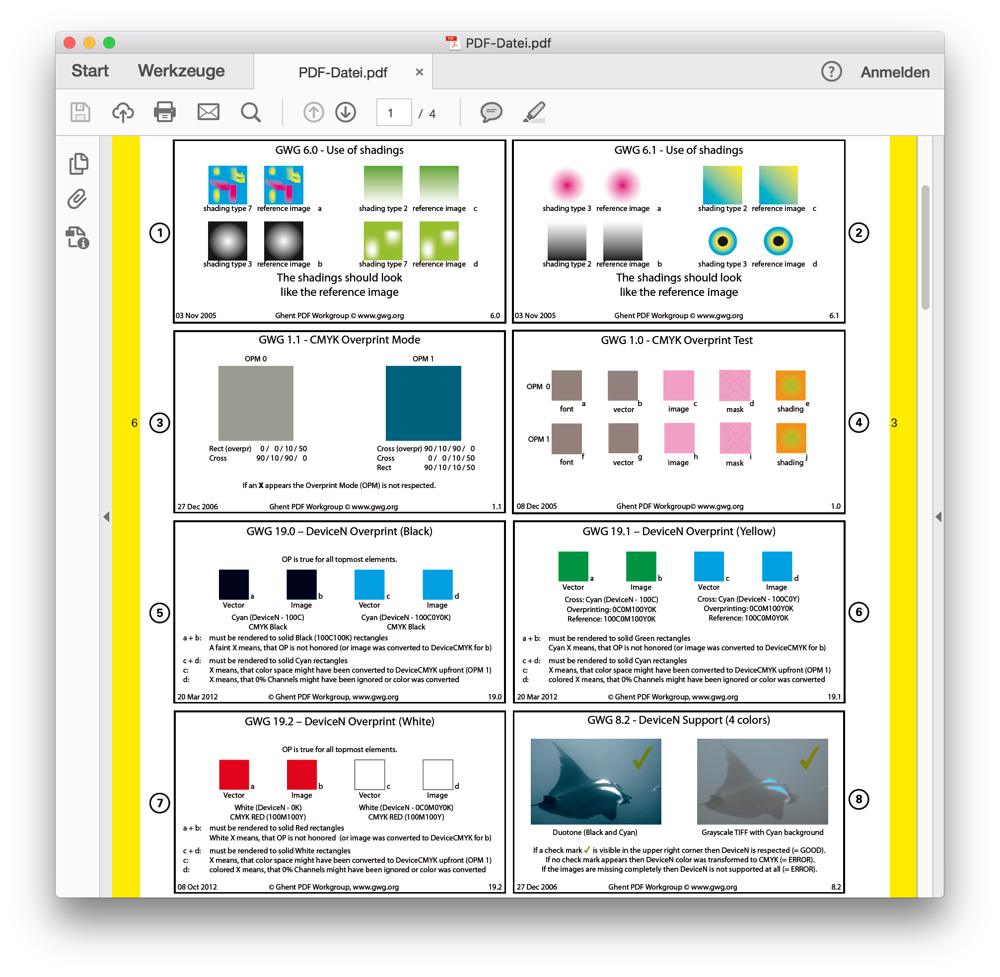

## Misconceptions

* <!-- .element: class="fragment" -->PDF always is immutable
* <!-- .element: class="fragment" -->PDF always looks the same
* <!-- .element: class="fragment" -->PDF is easy

## Misconceptions
### PDF always is immutable

## Misconceptions
### PDF always looks the same

<!-- .slide: data-transition="fade-out" -->

<!-- .slide: data-transition="fade-in" -->

## Misconceptions
### PDF is easy

* <!-- .element: class="fragment" --> HTML-Docs: ~ 700 Pages A4
* <!-- .element: class="fragment" --> PDF 1.7: ~ 1300 pages A4
* <!-- .element: class="fragment" --> plus specs for eg. PDF/X, PDF/UA, PDF/A
