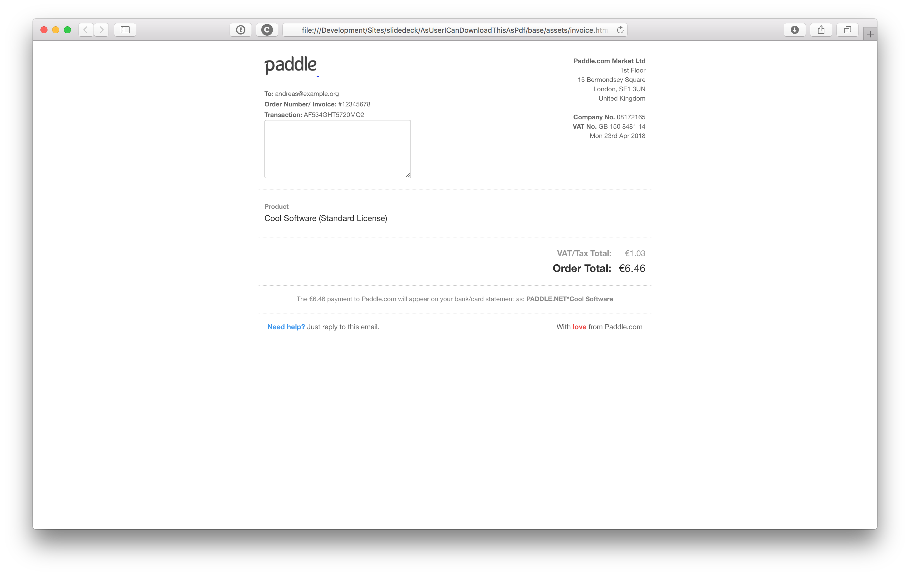
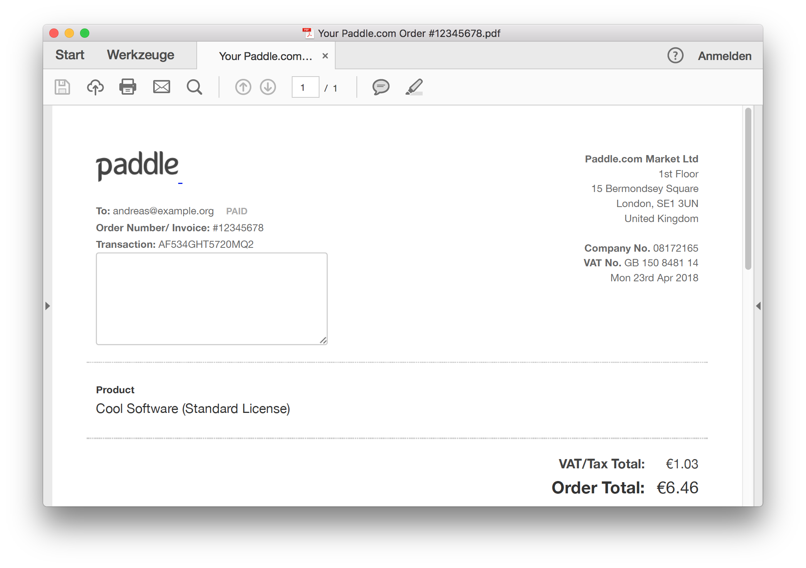

## Easy Entry

### An invoice

### An invoice

### An Invoice

### Advantages / Disadvantages

* <!-- .element: class="fragment" --> easy to implement
* <!-- .element: class="fragment" --> no additional tools on server
* <!-- .element: class="fragment" --> Endusers are…
* <!-- .element: class="fragment" --> tools need to be available to user
* <!-- .element: class="fragment" --> Only limited usage

### Optimization

* <!-- .element: class="fragment" --> Use @print styles
* <!-- .element: class="fragment" --> Avoid fixed paper-sizes on international sites
