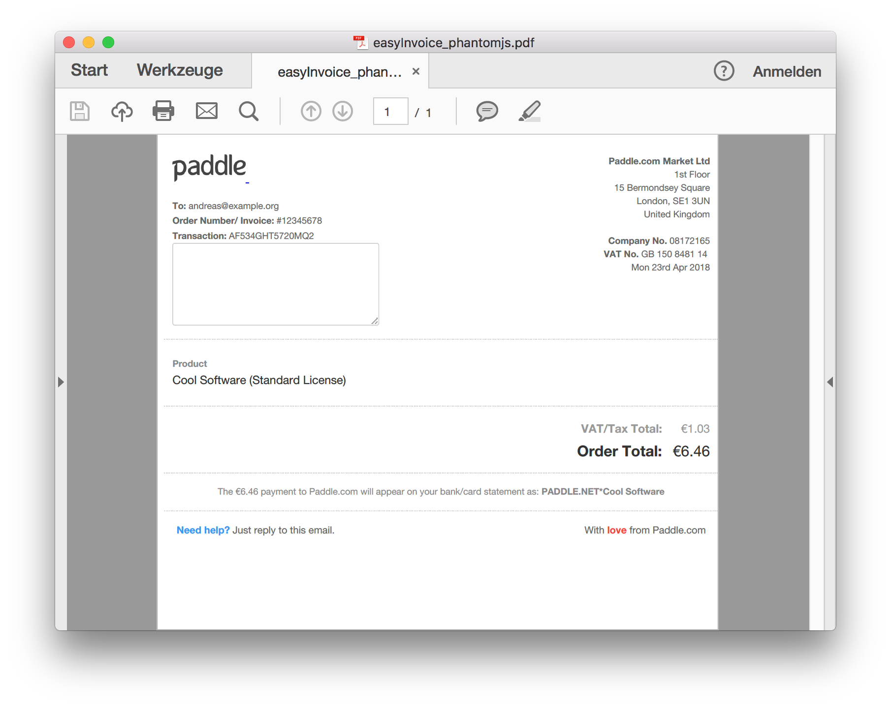

## Extend easy entry

Why not do the printing in a controlled environment?


### Server Side printing

Using Google Chrome

```bash
Google\ Chrome --headless \
   --print-to-pdf=/path/to/pdf \
   http://example.com/invoice.html
```


### Server Side printing


### Server Side printing

Using PhantomJS

```bash
phantomjs rasterize.js ../assets/invoice.html \
    easyInvoice_phantomjs.pdf
```

(uses [rasterize.js](https://github.com/ariya/phantomjs/blob/master/examples/rasterize.js))


### Server Side printing




### Server Side printing

* [wkhtmltopdf](https://wkhtmltopdf.org)
* [XSL-FO using FOP](https://xmlgraphics.apache.org/fop/)
* [PrinceXML](https://www.princexml.com/)
* …


### Advantages / Disadvantages

* <!-- .element: class="fragment" --> easy to implement
* <!-- .element: class="fragment" --> tools on server
* <!-- .element: class="fragment" --> full control
* <!-- .element: class="fragment" --> users need no tools
* <!-- .element: class="fragment" --> Only limited usage
* <!-- .element: class="fragment" --> Needs finished page


### Optimization

* <!-- .element: class="fragment" --> Use @print styles
* <!-- .element: class="fragment" --> depends on CLI-arguments
