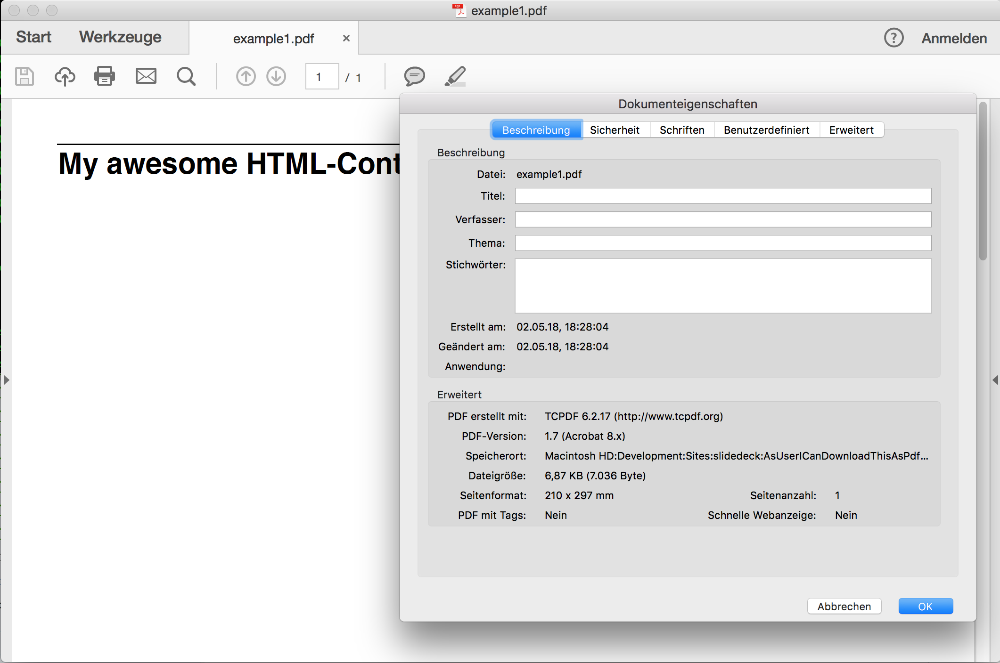
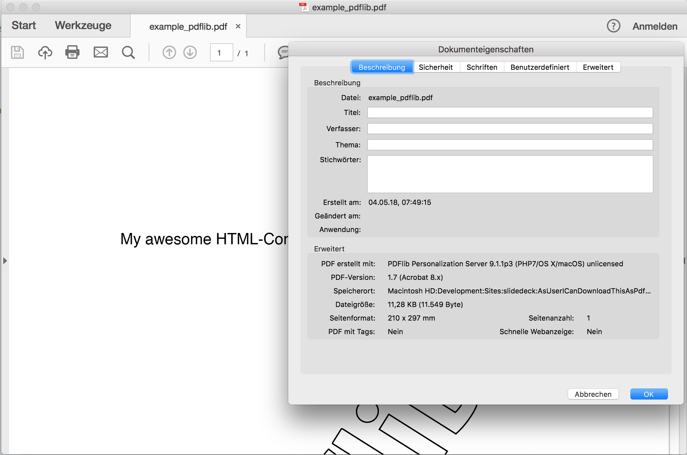

## Convert HTML-Fragments to PDF

* <!-- .element: class="fragment" --> Pass a fragment to a tool
* <!-- .element: class="fragment" --> everything around needs to be coded once


## Tools

* <!-- .element: class="fragment deprecated" --> [Zend_Pdf](https://framework.zend.com/manual/1.12/en/zend.pdf.html)
* <!-- .element: class="fragment deprecated" --> [Zeta Components Document](https://packagist.org/packages/zetacomponents/document)
* <!-- .element: class="fragment" --> [TCPDF](https://tcpdf.com)
* <!-- .element: class="fragment" --> [PDFlib](https://pdflib.com)

Note: TCPDF is declared deprecated on their website but they still release new versions. The replacement didn'T have a single version…


### TCPDF

* <!-- .element: class="fragment deprecated" --> Clone of FPDF
* <!-- .element: class="fragment deprecated" --> Pure PHP
* <!-- .element: class="fragment deprecated" --> is declared unsupported on tcpdf.com
* <!-- .element: class="fragment deprecated" --> Successor is not yet stable


### TCPDF

```bash
composer require tecnickcom/tcpdf
```


### TCPDF

```php
$html = '<h1>My awesome HTML-Content</h1>';
$pdf = new TCPDF(PDF_PAGE_ORIENTATION, PDF_UNIT,
  PDF_PAGE_FORMAT, true, 'UTF-8', false);

$pdf->AddPage();

$pdf->writeHTML($html, true, false, true, false, '');
echo $pdf->Output('', 'I');
```


### TCPDF



Note: put text between header and footer


### TCPDF
#### Pro/Con

* <!-- .element: class="fragment deprecated" --> Free
* <!-- .element: class="fragment deprecated" --> Easy to use
* <!-- .element: class="fragment deprecated" --> No extension needed (shared hosting!)
* <!-- .element: class="fragment deprecated" --> Great for text-documents
* <!-- .element: class="fragment deprecated" --> No drawing capabilities
* <!-- .element: class="fragment deprecated" --> Limited Annotation-Handling
* <!-- .element: class="fragment deprecated" --> No way to **read** PDF-information


### PDFlib

* <!-- .element: class="fragment deprecated" --> PHP-extension
* <!-- .element: class="fragment deprecated" --> Proprietary C-Library with bindings
* <!-- .element: class="fragment deprecated" --> Creator involved in PDF-Standards (PDF/UA f.e.)
* <!-- .element: class="fragment deprecated" --> Supports latest stable PHP-Version


### PDFlib

```bash
curl -o /tmp/pdflib.tgz https://www.pdflib.com/binaries/PDFlib/910/PDFlib-9.1.0-Linux-x86_64-php.tar.gz
sudo tar xvzf /tmp/pdflib.tgz -C /opt/
sudo bash -c "echo \"extension=/opt/PDFlib-9.1.0-Linux-x86_64-php/bind/php/php-710/php_pdflib.so\" \ 
  > /etc/php/7.1/mods-available/pdflib.ini"
sudo ln -s /etc/php/7.0/mods-available/pdflib.ini /etc/php/7.0/apache2/conf.d/20-pdflib.ini
```


### PDFlib

```php
$text = 'My awesome HTML-Content';

$pdf = new PDFlib();
$pdf->set_option("stringformat=utf8");
$pdf->begin_document('', "");
$pdf->begin_page_ext(595, 842, '');
$textflow = $pdf->create_textflow($text, '
  fontname=Helvetica fontsize=14 encoding=unicode fillcolor={gray 0}
  leading=120% alignment=justify embedding=true');
$result = $pdf->fit_textflow($textflow, 100, 100, 500, 700,
  "verticalalign=justify linespreadlimit=120% ");

$pdf->end_page_ext("");
$pdf->end_document("");

echo $pdf->get_buffer();
```


### PDFlib




### PDFlib
#### Pro/Con

* <!-- .element: class="fragment deprecated" --> Proprietary
* <!-- .element: class="fragment deprecated" --> Not Free
* <!-- .element: class="fragment deprecated" --> PHP-Extension
* <!-- .element: class="fragment deprecated" --> Not really OOP
* <!-- .element: class="fragment deprecated" --> Fast
* <!-- .element: class="fragment deprecated" --> (almost) no limits
* <!-- .element: class="fragment deprecated" --> Supports all PDF-Standards
