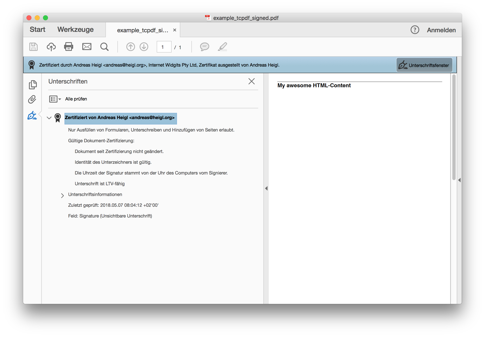
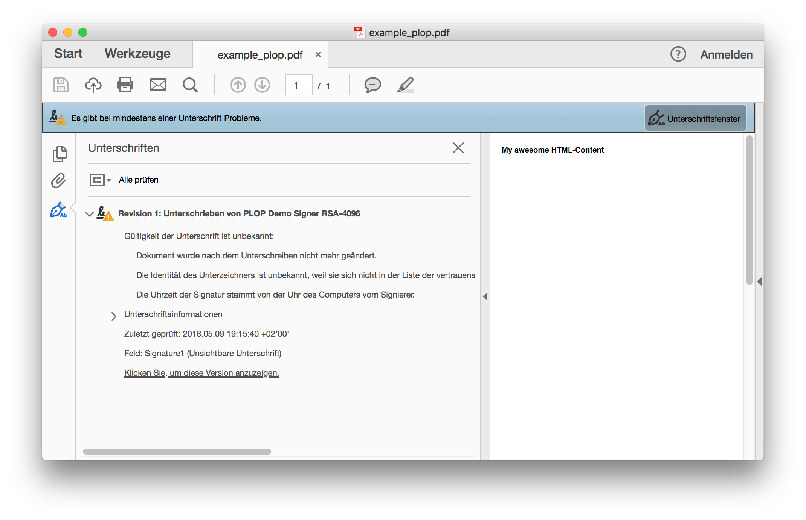

## Making PDFs "immutable"

<!-- .element: class="fragment deprecated" --> Actually they remain mutable but you'll recognize it


## Signing PDFs


### using TCPDF

```php
$public = $private = 'file://path/to/cert.crt';
// set document signature
$pdf->setSignature($public, $private, 'password', '', 2, []);
```


### using TCPDF




### using TCPDF


### using TCPDF
#### Pro/Con

* <!-- .element: class="fragment deprecated" --> Easy to use
* <!-- .element: class="fragment deprecated" --> Works out of the box
* <!-- .element: class="fragment deprecated" --> Only certificates, no [Qualified Electronic Signature](https://en.wikipedia.org/wiki/Qualified_electronic_signature)


### using PDFlib

* <!-- .element: class="fragment deprecated" --> You'll need PDFlib PLOP (DS)
* <!-- .element: class="fragment deprecated" --> Currently no bindings for PHP 7.2


### using PDFlib (and PLOP)

```php
$plop = new Plop();

$doc = $plop->open_document(__DIR__ . '/example1.pdf', '');
$plop->prepare_signature('digitalid={filename=certificate.p12} password=demo');
$plop->create_document(__DIR__ . '/example_plop.pdf', 'input=' . $doc);
$plop->close_document($doc, '');
```


### using PDFlib (and PLOP)




### using PDFlib (and PLOP)
#### Pro/Con

* <!-- .element: class="fragment deprecated" --> Easy to use
* <!-- .element: class="fragment deprecated" --> Fast
* <!-- .element: class="fragment deprecated" --> Supports all Standards
* <!-- .element: class="fragment deprecated" --> Supports Qualified Electronic Signature!!
* <!-- .element: class="fragment deprecated" --> another extension
* <!-- .element: class="fragment deprecated" --> picky with signatures
* <!-- .element: class="fragment deprecated" --> pricetag…
