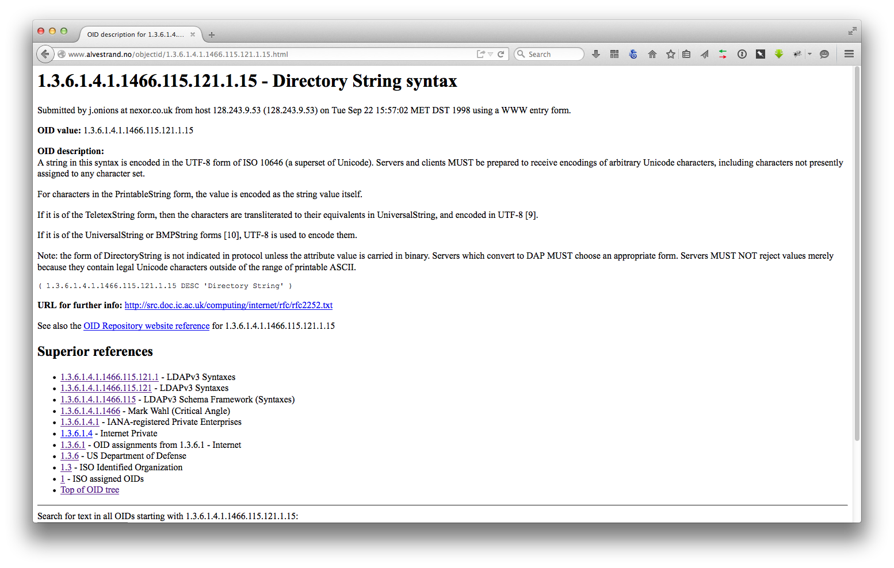

# LDAP Basics


<ul>
<li>Entries are identified by <strong>distinguished Name (DN)</strong></li>
<li class="fragment fade-in"><strong>Tree</strong>-like structure</li>
<li class="fragment fade-in">Attributes are defined by a <strong>scheme</strong></li>
<li class="fragment fade-in">Entries are defined by one or more <strong>objectClasses</strong></li>
<li class="fragment fade-in">Exchange via <strong>L</strong>DAP <strong>D</strong>ata <strong>I</strong>terchange <strong>F</strong>ormat (LDIF)</li>
</ul>


## Distinguished Name


dn: c=ch

dn: o=zurichphp,c=ch

dn: ou=liip,o=zurichphp,c=ch

Note:
Attribute equals a value, we'll get later to what attributs are available and what values are possible


## Tree-like structure


```plain
       ou = liip
                \
 ou = internal - o = zurichphp
                              \
      ou = zurich - o = liip - c = ch
                   /
        ou = geneva
        (external)

```

Note:
Reading from right to left. Makes it somewhat hard to read sometimes


## Schema


Attributes are defined with

* ID
* name
* search-rule
* data-type

Note:
Defines attribute-types and their conncetion to objectClasses.


Example:

```plain
attributetype ( 2.5.4.41 NAME 'name'
	EQUALITY caseIgnoreMatch
	SUBSTR caseIgnoreSubstringsMatch
	SYNTAX 1.3.6.1.4.1.1466.115.121.1.15{32768} )
```

Note:
Defines the attribute ```name``` UTF-8 string of maximum 32768 characters
that will be matched on search ignoring case.


```bash
$ ldapsearch -H ldap://ldap.example.com -x -s base -b \
 "cn=subschema" ldapsyntaxes
$ ldapsearch -H ldap://ldap.example.com -x -s base -b \
 "cn=subschema" attributeTypes
```

Note:
For a full list of ldapsysntaxes and attribute-types see


<a href="http://www.alvestrand.no/objectid/1.3.6.1.4.1.1466.115.121.1.15.html">

</a>

Note:
If you want to know what that cryptical number means:


## objectclass

Note:
So we've had DN, Tree structure, Schema, next would be objectClass
Objectclasses combine defined attributes to objects. They are also defined in schema-files


```plain
objectclass ( 2.5.6.0 NAME 'top' ABSTRACT
  MUST objectClass )
objectclass ( 2.5.6.6 NAME 'person' SUP top STRUCTURAL
  MUST ( sn $ cn )
  MAY ( userPassword $ telephoneNumber $ seeAlso $ description ) )

```

Note:
defines the objectclass *person* as sub-object of *top* which might
 contain the attributes ```userPassword```, ```telephoneNumber```, ```seeAlso```
 and ```description``` but has to contain the fields ```sn``` and ```cn```.


```bash
$ ldapsearch -H ldap://ldap.example.com -x -s base -b \
 "cn=subschema" objectclasses
```
Note:
For a full list see:


## LDIF

Note:
Last but not least:
We are now leaving the theoretical part and are actually doing some stuff. Only on the command line but hey, here's some code!


```bash
$ cat /tmp/heiglandreas.ldif
dn: uid=heiglandreas,o=phpugffm,c=de
objectClass: posixAccount
objectClass: organizationalPerson
cn: Andreas Heigl
uid: heiglandreas
sn: Heigl
uidNumber: 1
gidNUmber: 1000
homeDirectory: /dev/null
userpassword: mySecretPassword
```
Note:
Represents nodes or action for nodes in textual representation
posixAcount: MUST ( cn $ uid $ uidNumber $ gidNumber $ homeDirectory )MAY ( userPassword $ loginShell $ gecos $ description ) ),
organizationalPerson: MAY ( title $ x121Address $ registeredAddress $ destinationIndicator $ preferredDeliveryMethod $ telexNumber $ teletexTerminalIdentifier $ telephoneNumber $ internationaliSDNNumber $ facsimileTelephoneNumber $ street $ postOfficeBox $ postalCode $ postalAddress $ physicalDeliveryOfficeName $ ou $ st $ l ) )
person:  MUST ( sn $ cn ) MAY ( userPassword $ telephoneNumber $ seeAlso $ description ) )


```bash
$ ldapadd -H ldap://ldap.example.com -x -f /tmp/heiglandreas.ldif
```
Note:
Let's add someone to the LDAP
There's also ways of modifying and deleting stuff but I'll skip those here!
Oh, we've forgotten something....


# &lt;/basics&gt;<?php

Note:

Recap: some history, we know what a directory is, we know how the information
in the directory can be structured, we know what we can expect, we know how to
add, edit and remove data via the command-line.
Let's move on to some PHP-code