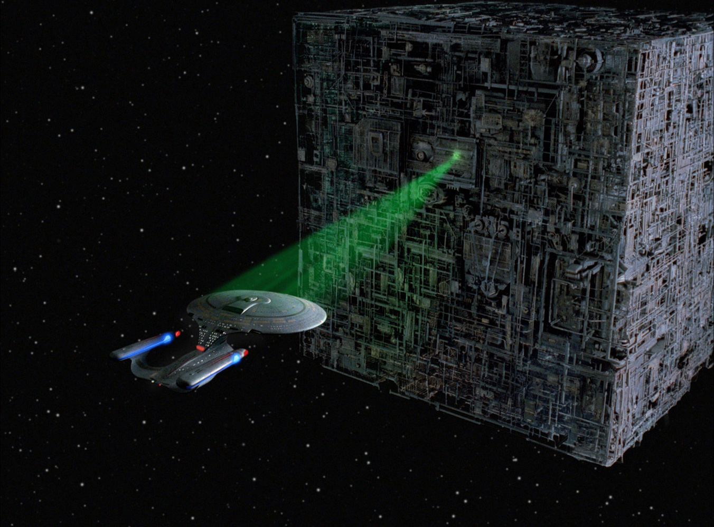
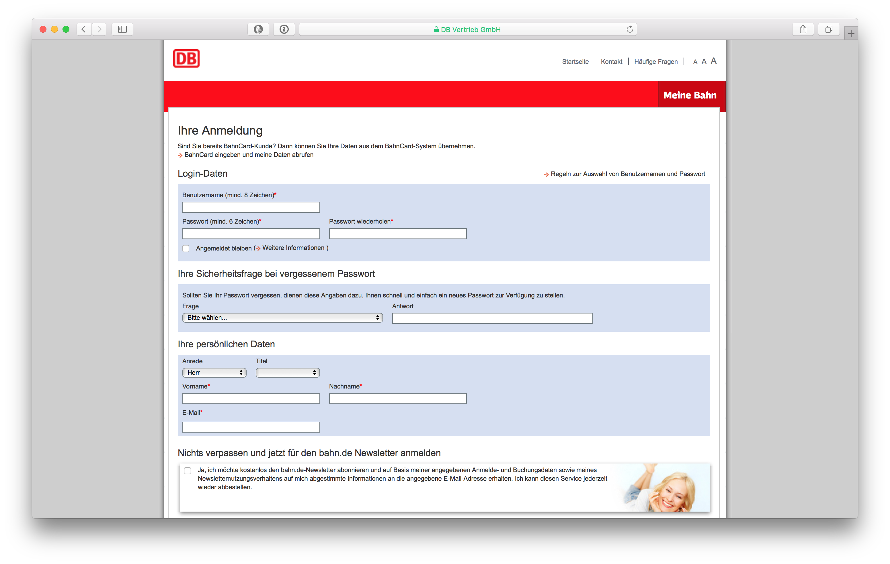

# The First Contact?

* <!-- .element: class="fragment" -->Your Registration-Form is the first real impression a user gets!
* <!-- .element: class="fragment" -->Before, it's advertisement

Note: GDPR is not the topic, but a lot has to do with it. Privacy by design

## Hi, I'm Andreas

* Software-Developer @ [bitExpert](https://bitExpert.de)
* Co-Organizer of [PHPUGFFM](http://phpugffm.de)
* Head behind [php.ug](https://php.ug) and [CallingAllPapers](https://callingallpapers.com)
* Maintainer of different OSS-libraries
* OSS-Contributor

