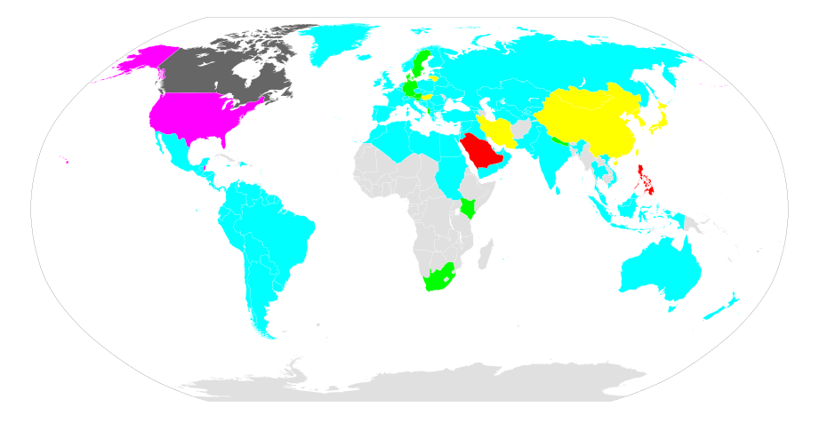

## Dates

### <!-- .element: class="fragment" --> Usually birthdates

* <!-- .element: class="fragment" --> ISO 8601
* <!-- .element: class="fragment" --> RFC 3339

### ISO 8601

> Year Month Day Hour Minute Second

### RFC 3339

> If date and time components are ordered from least precise to most
> precise, then a useful property is achieved

<!-- .element: class="fragment" --> RFC 3339 is a subset of ISO-8601

## Date

<a href="https://commons.wikimedia.org/w/index.php?curid=12680569">By TopoChecker - Own work based on: Date.svg  by Artem Karimov, Public Domain </a>

## Date

* <!-- .element: class="fragment" --> Make sure to tell me how to insert a date
* <!-- .element: class="fragment" --> &lt; input type="date"/&gt;
* <!-- .element: class="fragment" --> if ( $('[type="date"]')[0].type != 'date' ) $('[type="date"]').datepicker();
* <!-- .element: class="fragment" --> Sends *always* YYYY-MM-DD
* <!-- .element: class="fragment" --> Validate fault-tolerant

## Date

### References

* [RFC 3339](https://tools.ietf.org/html/rfc3339)
* [ISO 8601](https://en.wikipedia.org/wiki/ISO_8601)
* [one date-shim](https://stackoverflow.com/questions/18020950/how-to-make-input-type-date-supported-on-all-browsers-any-alternatives)
