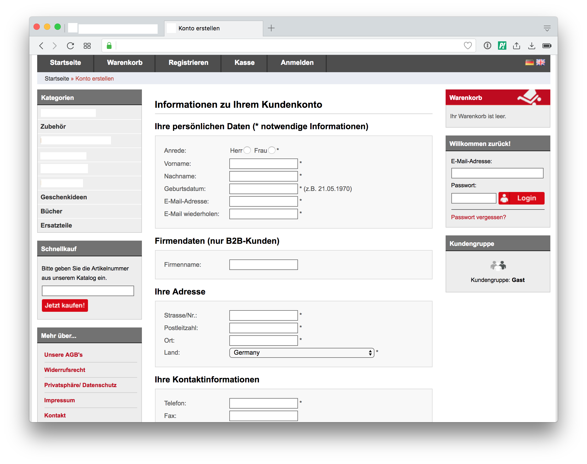

## Email

## Email

> There is no need to enter the email-address twice.

## Email

* <!-- .element: class="fragment" --> Do you require people to enter physical address twice?
* <!-- .element: class="fragment" --> You'll send an opt-in mail anyway
* <!-- .element: class="fragment" --> People will notice
* <!-- .element: class="fragment" --> Allow people to change the email-address

Note: Ankes Tippfehler in Adresse!

## Email

> Send a copy to the user!

## Email

### References

* https://ux.stackexchange.com/a/43020
