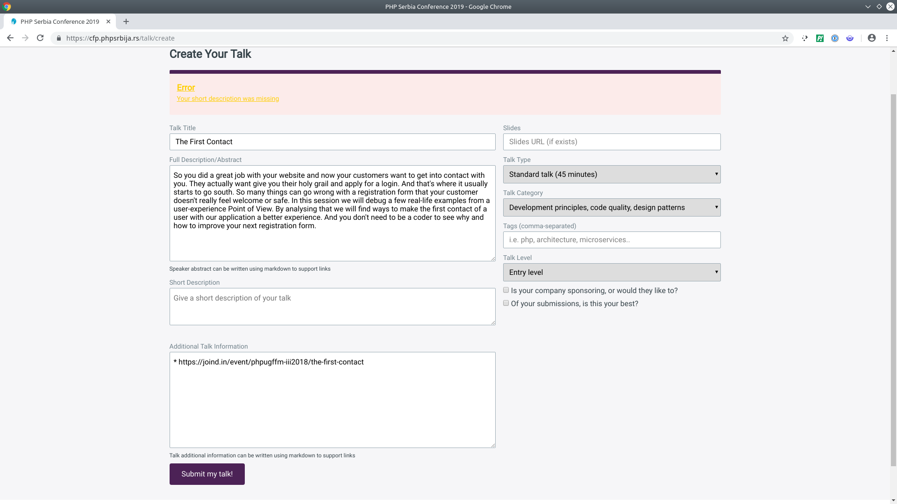

## Error-Messages

> What went wrong and what can I do against it

* Present **all** errors at once
* <!-- .element: class="fragment" --> Present Error-Messages where they can be fixed
* <!-- .element: class="fragment" --> Present End-User compatible error messages
* <!-- .element: class="fragment" --> Present actionable error messages

Note: Nothing is worse than sending a form multiple times only to get a new error each time.

### References

* https://www.steveworkman.com/web-design/2008/best-practice-error-messages/
