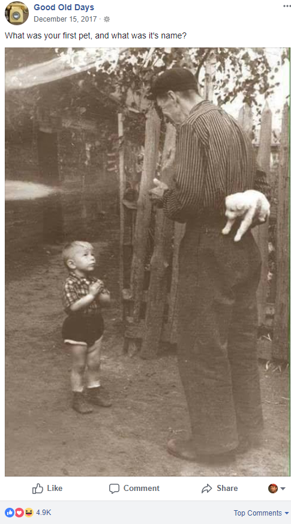

## Security Questions

> What can I say…

## Security Questions

> Try to avoid them!

## Security Questions

* <!-- .element: class="fragment" --> Do you really need them?
* <!-- .element: class="fragment" --> Don't use predefined questions
* <!-- .element: class="fragment" --> Make up your own set of questions

## Security Questions

## Security Questions

## Security Questions

> Security questions are a "backup password" that is easier to remember than a password.

Note: If the first password is either easy to remember or stored in a safe place there should be
no need for a backup.

## Security Questions

## Resources

* [Krebs on Security](https://krebsonsecurity.com/2018/04/dont-give-away-historic-details-about-yourself/)
