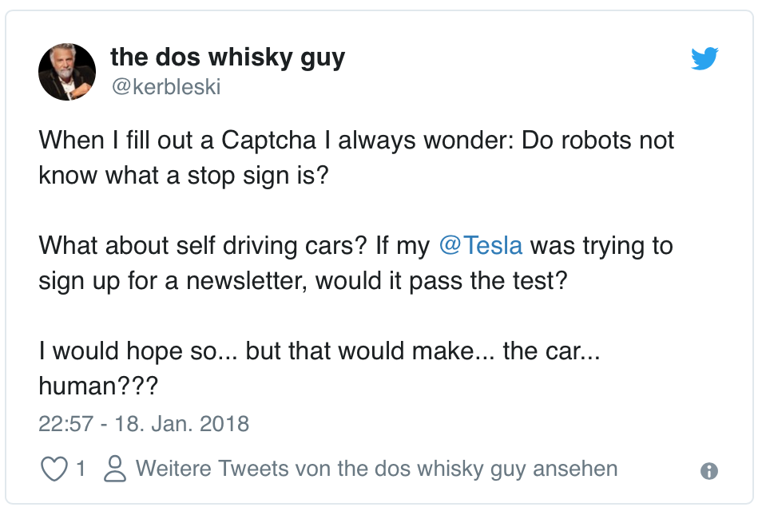

## Captchas

https://twitter.com/Cannibal/status/997912870556876800/photo/1

## Captchas

## Captchas

* <!-- .element: class="fragment" --> Are Ugly
* <!-- .element: class="fragment" --> Are hard to read
* <!-- .element: class="fragment" --> Discriminate users with disabilities
* <!-- .element: class="fragment" --> Use the user as workforce

Note: reCaptcha started to help digitizing books, was aquired by google in 2009

## Captchas

### Alternatives:

* <!-- .element: class="fragment" --> Honey-Pot
* <!-- .element: class="fragment" --> Math-Captcha
* <!-- .element: class="fragment" --> 2-Factor verification (mail or SMS)
