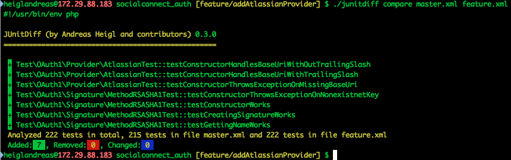

# Part 4
## Earn points for new tests

> JUnitDiff


### JUnitDiff

* What changed between two test-runs


### JUnitDiff

```bash
    git checkout master
    phpunit --log-junit master.xml
    git checkout feature/branch
    phpunit --log-junit feature.xml
    junitdiff compare master.xml feature.xml
```


### JUnitDiff




<!--
### JUnitDiff

```yaml
cache:
  directories:
  - junitlogs

install:
- mkdir -p junitlogs
- curl -LO https://github.com/heiglandreas/JUnitDiff/releases/download/0.5.0/junitdiff.phar

script:
  - phpunit --log-junit junitlogs/`git rev-parse HEAD`.log",
  - if [[ $TRAVIS_PULL_REQUEST != 'false' && -f junitlogs/`git merge-base HEAD master`.log ]]; then php junitdiff.phar compare junitlogs/`git merge-base HEAD master`.log junitlogs/`git rev-parse HEAD`.log; fi
```
-->
