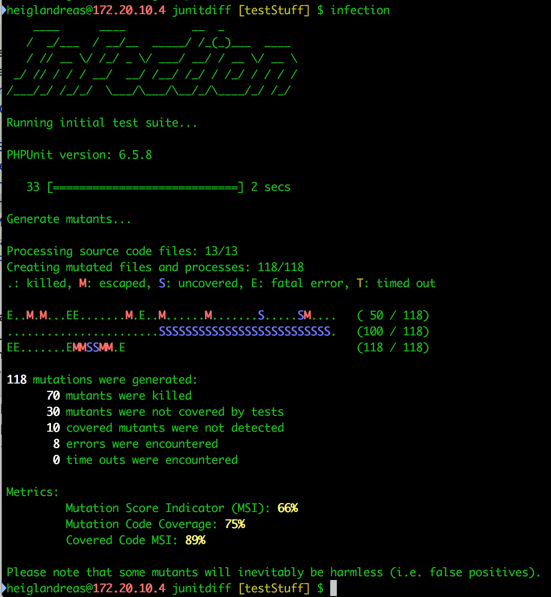

# Part 7
## Earn points with *good* Code-Coverage

> how good are my tests


## Humbug

> eats Code Coverage for breakfast


## ~~Humbug~~

Doesn't work with PHPUnit >= 6


## Infection

* <!-- .element: class="fragment" -->Mutations Testing Framework
* <!-- .element: class="fragment" -->Alters your code to see whether your tests detect that


### Infection




### Infection

```
35) /Development/Sites/org.heigl/junitdiff/src/MergeResult.php:80    [M] FunctionCall
exec /usr/local/Cellar/php/7.2.3_2/bin/php -c /private/var/folders/bd/9dpm2p7j7bz349744k34dhyr0000gp/T/infection1cp0YM /Development/Sites/org.heigl/junitdiff/vendor/phpunit/phpunit/phpunit --configuration /var/folders/bd/9dpm2p7j7bz349744k34dhyr0000gp/T/infection/phpunitConfiguration.832197d1bac0bada9f60ee1b5b59dab7.infection.xml --stop-on-failure
--- Original
+++ New
@@ @@
     {
-        return count($this->content);
+        count($this->content);
+        return null;
     }
     public function countBase()
     {
         $counter = 0;
         foreach ($this->content as $value) {
PHPUnit 6.5.8 by Sebastian Bergmann and contributors.

....F

Time: 37 ms, Memory: 4.00MB

There was 1 failure:

1) Org_Heigl\JUnitDiffTest\MergeResultTest::testThatCountingTotalsWorks
Failed asserting that null matches expected 5.

/Development/Sites/org.heigl/junitdiff/tests/MergeResultTest.php:111

FAILURES!
Tests: 5, Assertions: 12, Failures: 1.
```
