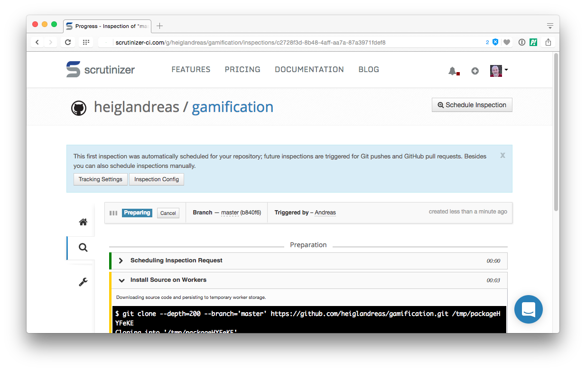

# Part 11
## Earn points with Static Code-Analysis

> What can be optimized


## Static Code-Analysis

* <!-- .element: class="fragment" -->[PHP Inspections](https://plugins.jetbrains.com/plugin/7622-php-inspections-ea-extended-)
* <!-- .element: class="fragment" -->[PHPStan](https://github.com/phpstan/phpstan) - PHP ^7.1
* <!-- .element: class="fragment" -->[Psalm (vimeo)](https://github.com/vimeo/psalm) - PHP ^5.6
* <!-- .element: class="fragment" -->[Phan (etsy)](https://github.com/etsy/phan) - PHP ^7.0
* <!-- .element: class="fragment" -->…


## PHP-Inspections


## PHPStan

```bash
$ phpstan.phar analyze src/
 7/7 [▓▓▓▓▓▓▓▓▓▓▓▓▓▓▓▓▓▓▓▓▓▓▓▓▓▓▓▓] 100%


 [OK] No errors


 ! [NOTE] PHPStan is performing only the most basic checks. You can pass a higher rule level through the --level option
 !        (the default and current level is 0) to analyse code more thoroughly.
 ```


# Part 12
## Earn points with automated Static Code-Analysis

* <!-- .element: class="fragment" -->[Scrutinizer](https://scrutinizer.com)
* <!-- .element: class="fragment" -->[CodeClimate](https://codeclimate.com)
* <!-- .element: class="fragment" -->[Codacy](https://codacy.com)
* <!-- .element: class="fragment" -->[Sensiolabs Insight](http://insight.sensiolabs.com)
* <!-- .element: class="fragment" -->[Sonarqube](https://www.sonarqube.org)


## Scrutinizer




## Scrutinizer


## Scrutinizer


## Scrutinizer


## Scrutinizer


## Scrutinizer


# Step 13
## Earn points for Project Quality

* Sensiolabs Insight


## Insight


## Insight


## Insight


## Insight


## Insight


