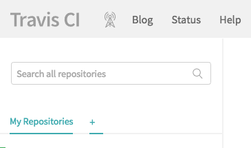
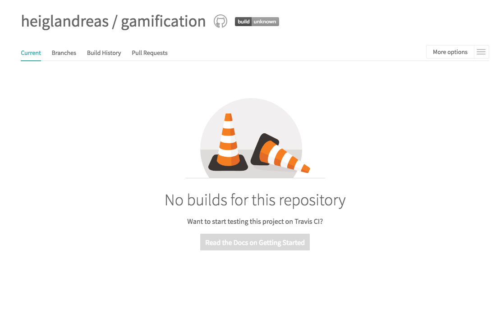
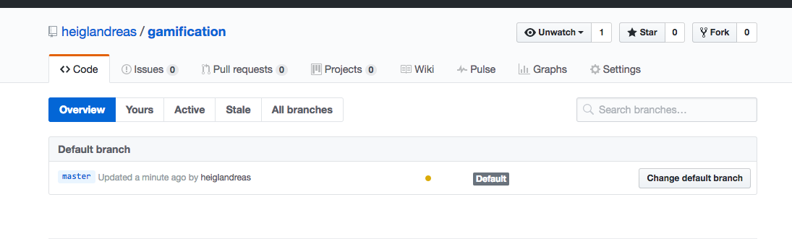
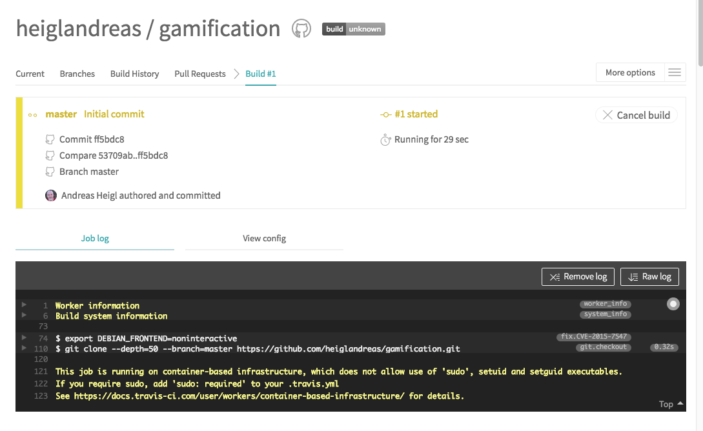
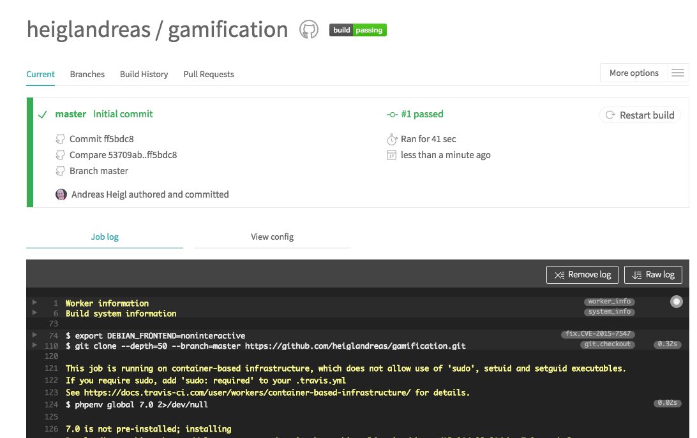

## Part 5: Earn points for automating tests

* Travis-CI
* Circle-CI
* Gitlab-CI
* Jenkins
* Bamboo
* …


### Travis-CI


### Travis-CI




### Travis-CI


### Travis-CI




### Travis-CI

.travis.yml
```yml
language: php
php: 
  - 7.3
before-script:
  - composer install
script:
  - vendor/bin/phpunit
```


### Travis-CI




### Travis-CI




### Travis-CI


