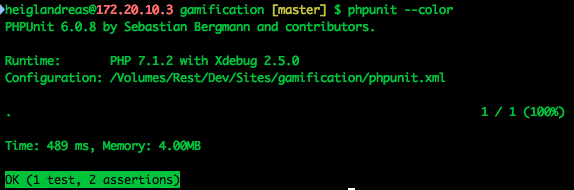
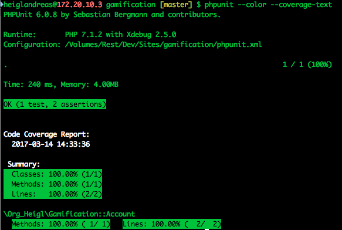

## Part 6: Earn points with Code-Coverage

> how much of my code is covered by tests

## Code-Coverage

## Code-Coverage

## Code-Coverage

## Code-Coverage

> Don't *force* 100%

## Code-Coverage

> Shows *that* a line is used within a test. 
> It's only a measurement of *quantity*, not *quality*

