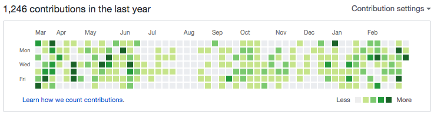
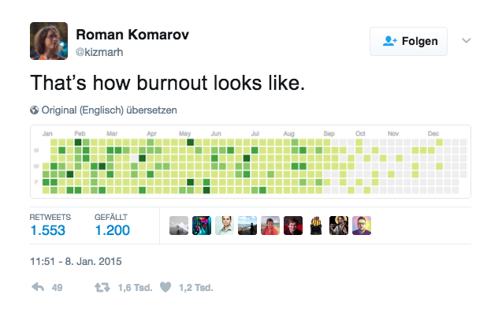

## Step 1: Earn points for sharing

Note: Share your code. Your code is good and can only get better! Don't fear
others opinion on it!

### Don't overdo it!

> Github-Contribution is **no** sane metric!!!

