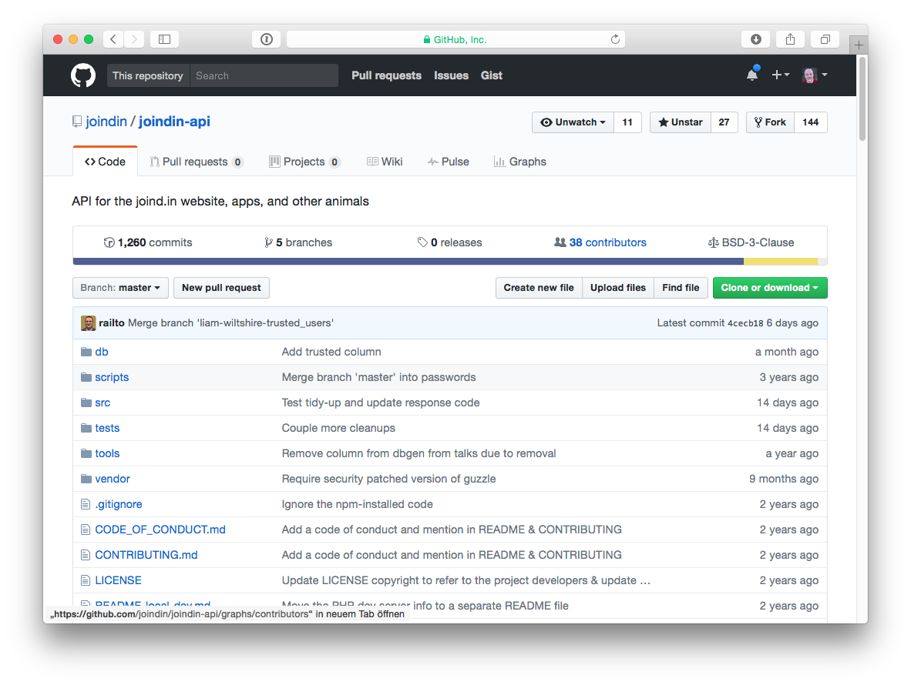

## Part 1: Earn points for sharing

Note: Share your code. Your code is good and can only get better! Don't fear
others opinion on it!

### Don't overdo it!

> Github-Contribution is **no** sane metric!!!

## Part 2: Earn points for contributing

Note: Contributing to code causes you to read others code. Reading introduces new
Concepts. Causes you to adapt and extend your knowledge. 

### Project-Contributors

### Project-Contributors

Note: Based on commits, not on PRs. So the more commits, the better. Make small commits!

