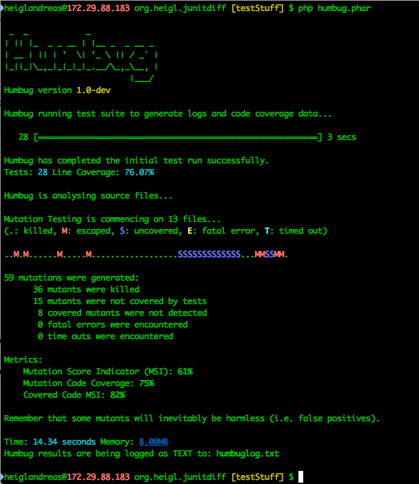

## Part 7: Earn points with *good* Code-Coverage

> how good are my tests


## Humbug

> eats Code Coverage for breakfast


## Humbug

* Mutations Testing Framework
* Alters your tests to break them


### Humbug




### Humbug

```
4) \Humbug\Mutator\Number\FloatValue
Diff on \Org_Heigl\JUnitDiff\JUnitParser::parseFile() in /Volumes/Rest/Dev/Sites/org.heigl.junitdiff/src/JUnitParser.php:
--- Original
+++ New
@@ @@
-        $dom = new \DOMDocument(1.0, 'UTF-8');
+        $dom = new \DOMDocument(0.00, 'UTF-8');
```
