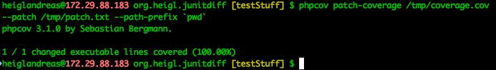
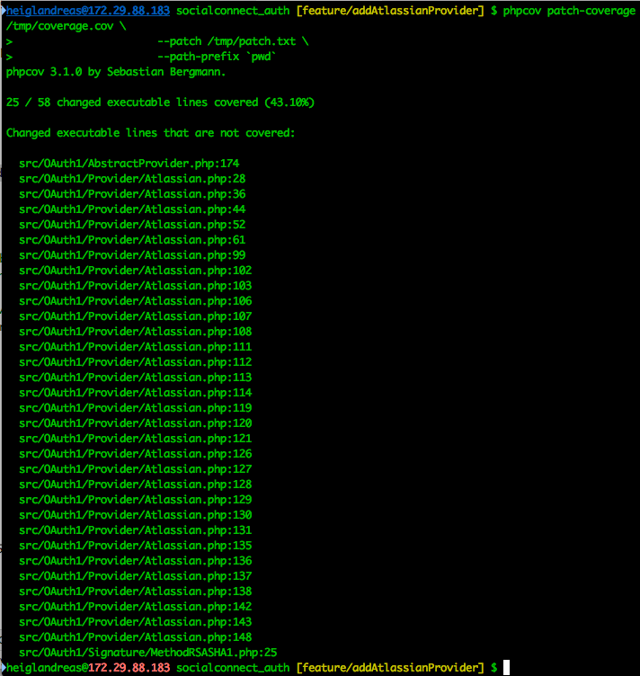

## Part 8: Earn points for Patch-Coverage 

> how much of my **new** code is covered by tests


### Patch-Coverage




### Patch-Coverage

```bash
git diff `git merge-base HEAD master` > /tmp/patch.txt
phpunit --coverage-php /tmp/coverage.cov
phpcov patch-coverage /tmp/coverage.cov \
                      --patch /tmp/patch.txt \
                      --path-prefix `pwd`
```


### Patch-Coverage


