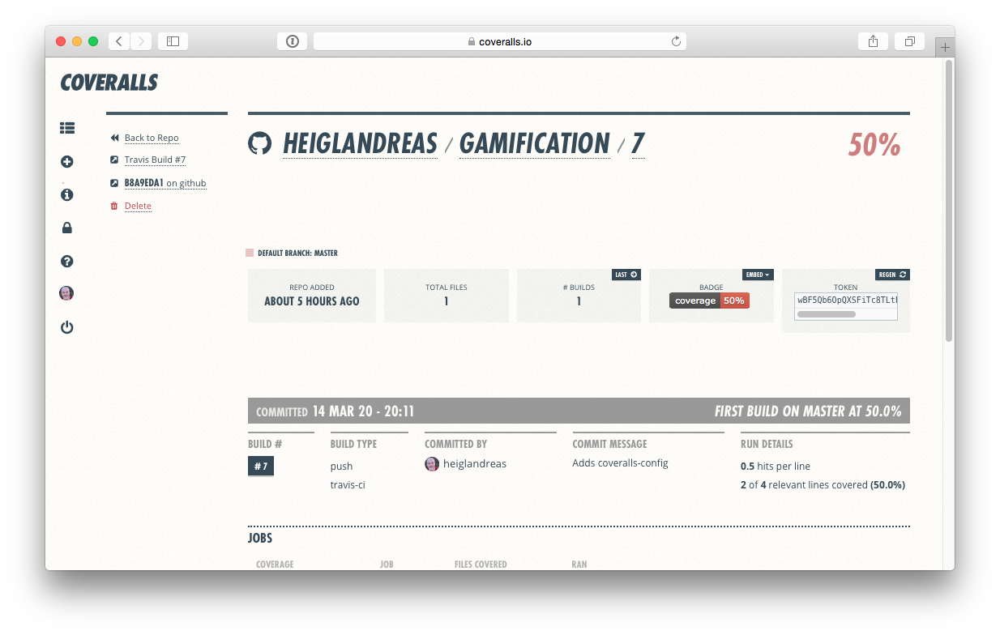
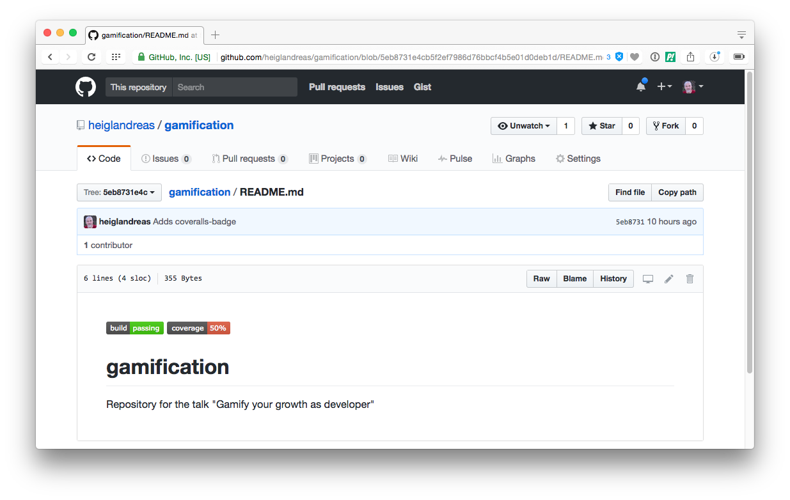

## Step 4: Automate Code-Coverage


## Coveralls.io


## Coveralls.io


## Coveralls.io


## Coveralls.io


## Coveralls.io


## Coveralls.io


## Coveralls.io

```yml
language: php
php:
  - 7.0

install:
  - composer require --dev satooshi/php-coveralls
before_script:
  - composer install
script:
  - vendor/bin/phpunit --coverage-clover clover.xml
after_script:
  - vendor/bin/coveralls -v
```
```.travis.yml```


## Coveralls.io

```yml
coverage_clover: clover.xml
json_path: coveralls-upload.json
```
```.coveralls.yml```


## Coveralls.io


## Coveralls.io




## Coveralls.io


## Coveralls.io


## Coveralls.io


## Coveralls.io



