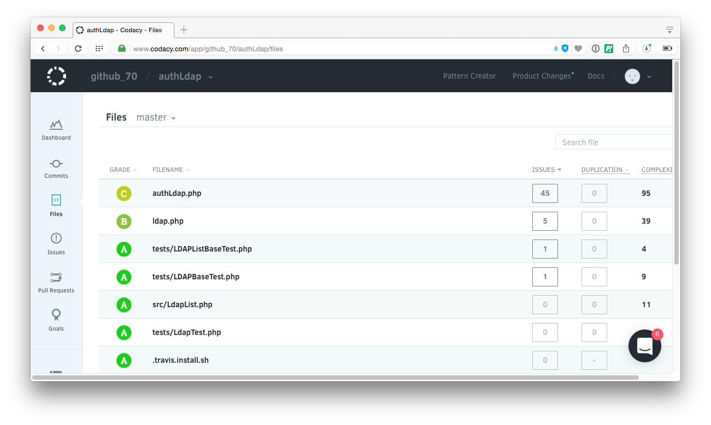
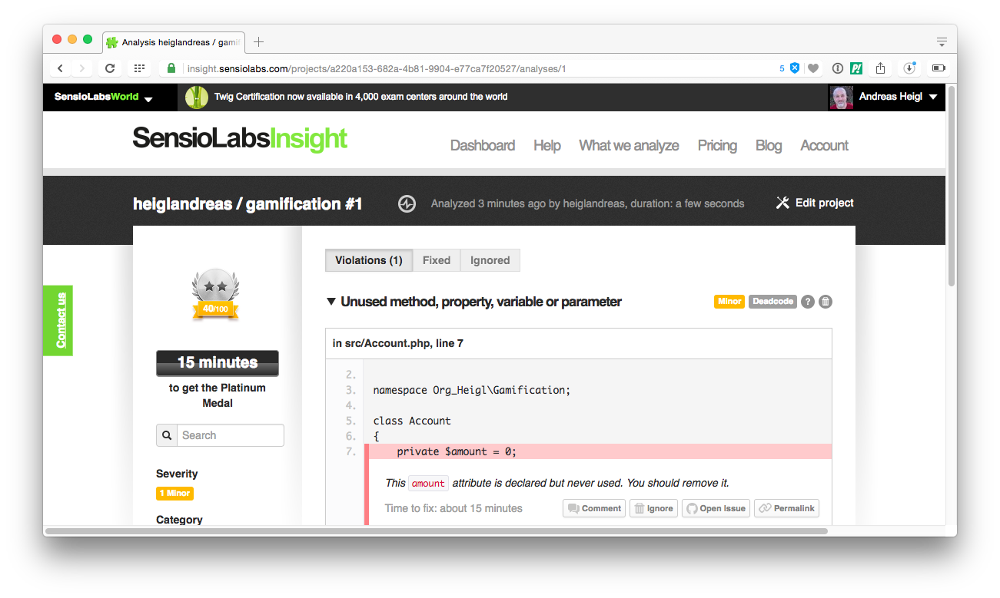
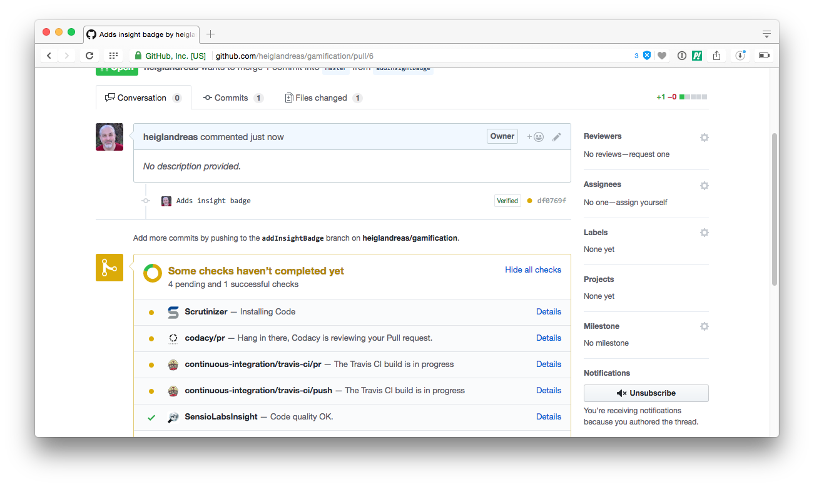
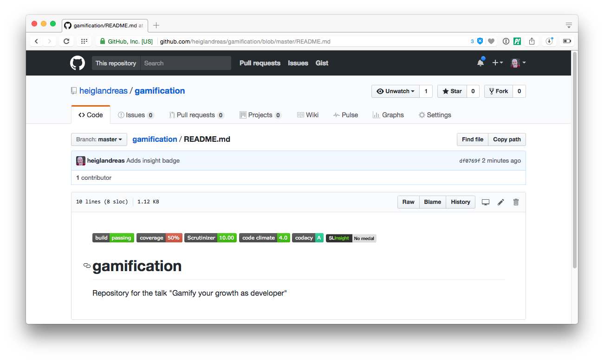

## Automated Code-Reviews

Different kind of metrics

## Step 7: Scrutinizer

* Static Code Analyzer
* CI-Server
* Automated Code-Review

## Scrutinizer

## Scrutinizer

## Scrutinizer

## Scrutinizer

## Scrutinizer

## Scrutinizer

## Scrutinizer

## Scrutinizer

## Scrutinizer

## Scrutinizer

## Scrutinizer

## Scrutinizer

## Step 8: Code Climate

* Automated Code-Review

## Code Climate

## Code Climate

## Code Climate

## Code Climate

## Code Climate

## Code Climate

## Code Climate

## Code Climate

## Code Climate

## Code Climate

## Code Climate

## Code Climate

[Example Output](../base/sites/codeclimate_bad_example.html)

## Code Climate

 

## Step 9: Codacy

* Automated Code-Review and Metrics analysis

## Codacy

## Codacy

## Codacy

## Codacy

## Codacy

## Codacy

## Codacy

## Codacy

## Codacy

## Codacy

## Codacy

## Codacy

## Codacy

## Codacy

## Step 10: Insight 

* Project-Quality

## Insight

## Insight

## Insight

## Insight

## Insight

## Insight

## Insight

## Insight

## Insight

## Insight

## Insight

## Insight

## Insight

