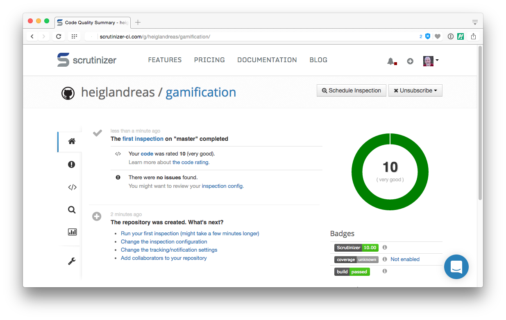
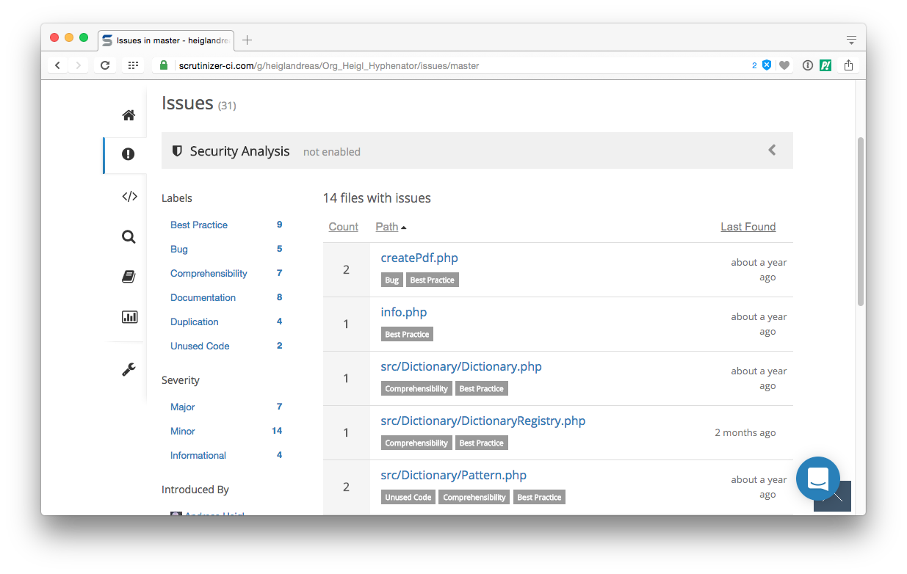
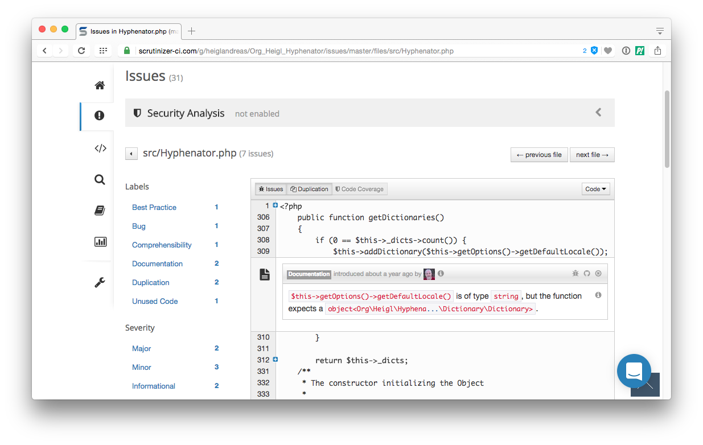
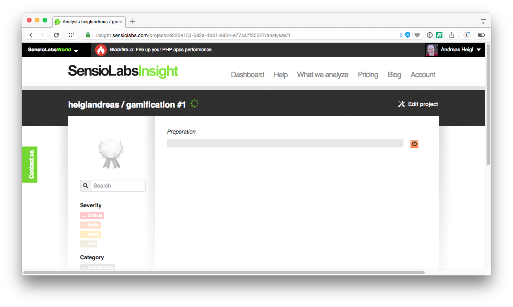

## Part 11: Earn points with Static Code-Analysis

> What can be optimized

## Static Code-Analysis

* [PHP Inspections](https://plugins.jetbrains.com/plugin/7622-php-inspections-ea-extended-)
* [PHPStan](https://github.com/phpstan/phpstan) - PHP ^7.1
* [Psalm (vimeo)](https://github.com/vimeo/psalm) - PHP ^5.6
* [Phan (etsy)](https://github.com/etsy/phan) - PHP ^7.0
* …

## PHP-Inspections

## Part 12: Earn points with automated Static Code-Analysis
 
* [Scrutinizer](https://scrutinizer.com)
* [CodeClimate](https://codeclimate.com)
* [Codacy](https://codacy.com)
* [Sensiolabs Insight](http://insight.sensiolabs.com)
* [Sonarqube](https://www.sonarqube.org)
* …

## Scrutinizer

* Static Code Analyzer
* CI-Server
* Automated Code-Review

## Scrutinizer

## Scrutinizer

## Scrutinizer

## Scrutinizer

## Scrutinizer

## Scrutinizer

## Scrutinizer

## Step 13: Earn points for Project Quality 

* Sensiolabs Insight

## Insight

## Insight

## Insight

## Insight

## Insight

## Insight

