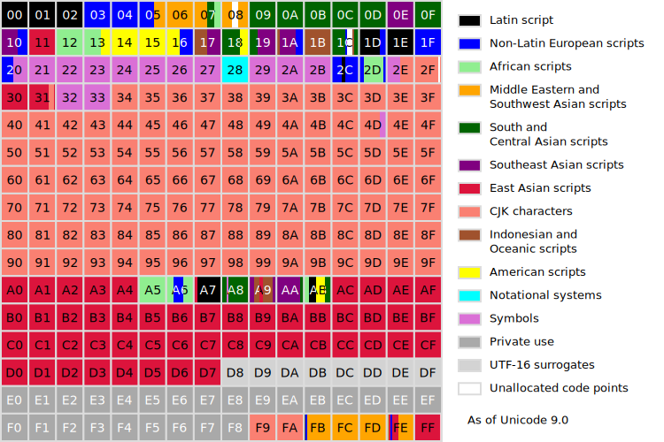

# Wouldn't it be cool

## to have **all** characters available?

# Enter Unicode

* <!-- .element: class="fragment"-->Characterset
* <!-- .element: class="fragment"-->ISO-8859-1 compatible
* <!-- .element: class="fragment"-->ASCII compatible
* <!-- .element: class="fragment"-->v1.0 1991 (65.536 Codepoints)
* <!-- .element: class="fragment"-->v2.0 1996 (1.114.112 Codepoints)
* <!-- .element: class="fragment"-->v6.0 2010 (Emojis) …

# Unicode

* <!-- .element: class="fragment"-->Defines 17 "planes" with 65.536 Codepoints each
* <!-- .element: class="fragment"-->Codepoints are defined by 2 bytes within a plane
* <!-- .element: class="fragment"-->Private-use area
* <!-- .element: class="fragment"-->Most commonly used characters are within 1st plane
* <!-- .element: class="fragment"-->v2.0 1996 (1.114.112 Codepoints)
* <!-- .element: class="fragment"-->Multiple ways to describe one character => Normalisation
* <!-- .element: class="fragment"-->Multiple ways to compare characters => Collation

# Unicode

# Unicode

## Examples:

* <!-- .element: class="fragment"-->**A** => U+0041
* <!-- .element: class="fragment"-->**ñ** => U+00F1 / U+0063 U+0303
* <!-- .element: class="fragment"-->**ค** => U+0E04
* <!-- .element: class="fragment"-->💩 => U+01F4A9 / U+D83D U+DCA9

# Unicode

## Encoding

* <!-- .element: class="fragment"-->UTF-32
* <!-- .element: class="fragment"-->UTF-16
* <!-- .element: class="fragment"-->UTF-8

# UTF-16

* <!-- .element: class="fragment"-->2 Bytes
* <!-- .element: class="fragment"-->always!
* <!-- .element: class="fragment"-->Only 1st plane (or Multibyte)
* <!-- .element: class="fragment"-->Windows, macOS, Java
* <!-- .element: class="fragment"-->Not streamsafe
* <!-- .element: class="fragment"-->Which is the "first" byte (BOM)

Note: BOM => FEFF | FFFE

# UTF-16
## Supplementary Characters

😂 0x01F602

* <!-- .element: class="fragment"-->Subtract 0x010000 (0x00F602)
* <!-- .element: class="fragment"-->0000 1111 0110 0000 0010
* <!-- .element: class="fragment"-->Add first 10 bit to 0xD800 (0xD83D)
* <!-- .element: class="fragment"-->Add second 10 bit to 0xDC00 (0xDE02)
* <!-- .element: class="fragment"-->0xD83D 0xDE02

# UTF-8

* <!-- .element: class="fragment"-->1 to 4 bytes
* <!-- .element: class="fragment"-->All Codepoints (and even more)
* <!-- .element: class="fragment"-->Linux, Web
* <!-- .element: class="fragment"-->streamsafe
* <!-- .element: class="fragment"-->BOM allowed but not necessary (EF BB BF)

# UTF-8

## Single byte

* <!-- .element: class="fragment"-->always starts with a 0 bit
* <!-- .element: class="fragment"-->followed by the ASCII-Code
* <!-- .element: class="fragment"-->A => 01000001

# UTF-8

## Multibyte

* <!-- .element: class="fragment"-->each byte starts with a 1 bit
* <!-- .element: class="fragment"-->followed by a 1 for each follow-up byte in the first byte
* <!-- .element: class="fragment"-->or a 0 for the following bytes

# UTF-8

## Multibyte

* <!-- .element: class="fragment"-->0xxxxxxx
* <!-- .element: class="fragment"-->110xxxxx 10xxxxxx
* <!-- .element: class="fragment"-->1110xxxx 10xxxxxx 10xxxxxx
* <!-- .element: class="fragment"-->11110xxx 10xxxxxx 10xxxxxx 10xxxxxx
* <!-- .element: class="fragment"-->**x** is payload

# UTF-8

## Examples

### **Ä** => U+00C4 => 11000100

11000011 10000100

# UTF-8

## streamsafe

* <!-- .element: class="fragment"-->0xxxxxxx 10xxxxxx 0xxxxxxx
* <!-- .element: class="fragment"-->110xxxxx 0xxxxxxx
* <!-- .element: class="fragment"-->1110xxxx 10xxxxxx 0xxxxxxx
* <!-- .element: class="fragment"--> All will result in �

# &lt;/basics>&lt;code>
