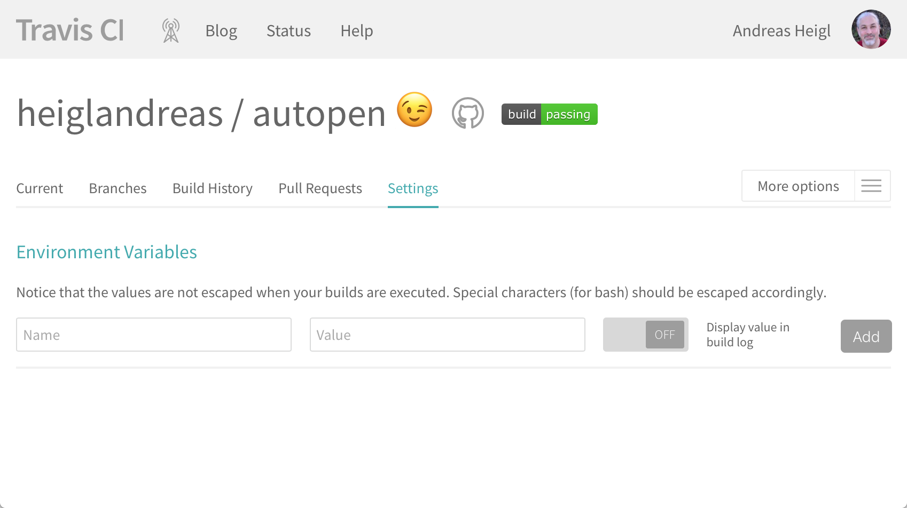

# Automate all the things


1. <!-- .element: class="fragment" data-fragment-index="1"-->Export key
2. <!-- .element: class="fragment" data-fragment-index="2"-->Encrypt the key
3. <!-- .element: class="fragment" data-fragment-index="3"-->Add the encrypted key to the repo
4. <!-- .element: class="fragment" data-fragment-index="4"-->Add the passphrase securely to the build-process
5. <!-- .element: class="fragment" data-fragment-index="5"-->Decrypt the key during build
6. <!-- .element: class="fragment" data-fragment-index="6"-->Sign build-artifacts using the decrypted key
7. <!-- .element: class="fragment" data-fragment-index="7"-->Deploy Signature


## 1. Export keys

> <!-- .element: class="fragment" data-fragment-index="1"-->GPG stores keys in a keychain.

```bash
$ gpg --export -a [keyid] > key.asc
$ gpg --export-secret-key -a [keyid] >> key.asc 
```

<!-- .element: class="fragment" data-fragment-index="2"-->**keep *key.asc* secure at all times!!!**
 


## 2. Encrypt the key

```bash
$ gpg -c key.asc
# results in key.asc.gpg
```

<!-- .element: class="fragment" data-fragment-index="1"-->You'll be asked for a password! Make sure you don't loose it!


## 3. Add encrypted key to repo

```bash 
$ git add key.asc.gpg
$ git commit -m "Adds Encrypted Signing key"
$ rm -rf key.asc
```


## 4. Add the passphrase securely to the build-process

<!-- .element: class="fragment" data-fragment-index="1"-->This highly depends on CI-Server! 

<!-- .element: class="fragment" data-fragment-index="2"-->


## 5. Decrypt the key during build.

```bash
$ echo $DECRYPT_KEY | gpg --passphrase-fd 0 key.asc.gpg  
$ gpg --batch --yes --import key.asc
```


## 6. Sign build-artifacts

```bash
$ gpg -u [keyid] -a --detach-sig [build-artifact]
```


## 7. Deploy signature

<!-- .element: class="fragment" data-fragment-index="1"-->It highly depends on CI-Server


## My Example ```.travis.yml```-file

```yml
before_deploy:
  - echo $DECRYPT_KEY | gpg --passphrase-fd 0 key.asc.gpg && \
     gpg --batch --yes --import key.asc
  - gpg  -u [keyid] --armor --detach-sig [build-artifact]

deploy:
  provider: releases
  api_key: $GITHUB_API_KEY
  file:
    - [build-artifact]
    - [build-artifact].asc
  skip_cleanup: true
  on:
    tags: true
    php: 7.1
```


# Congratulations on creating an autopen
