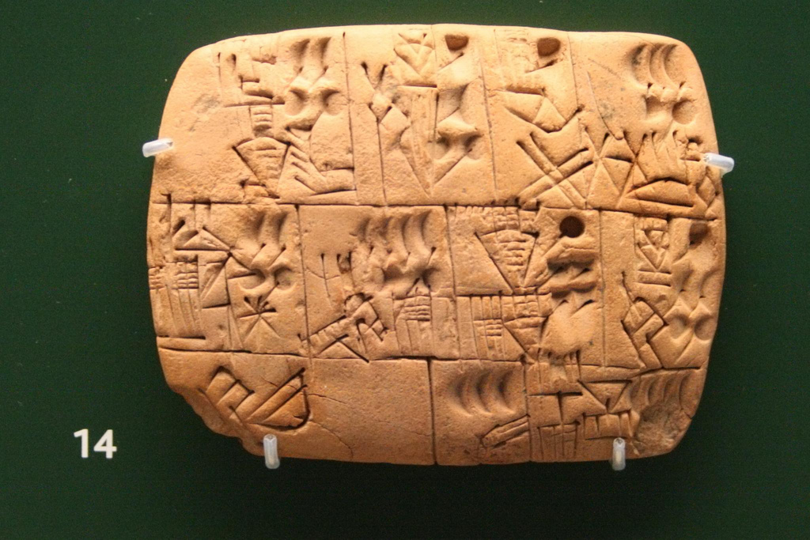
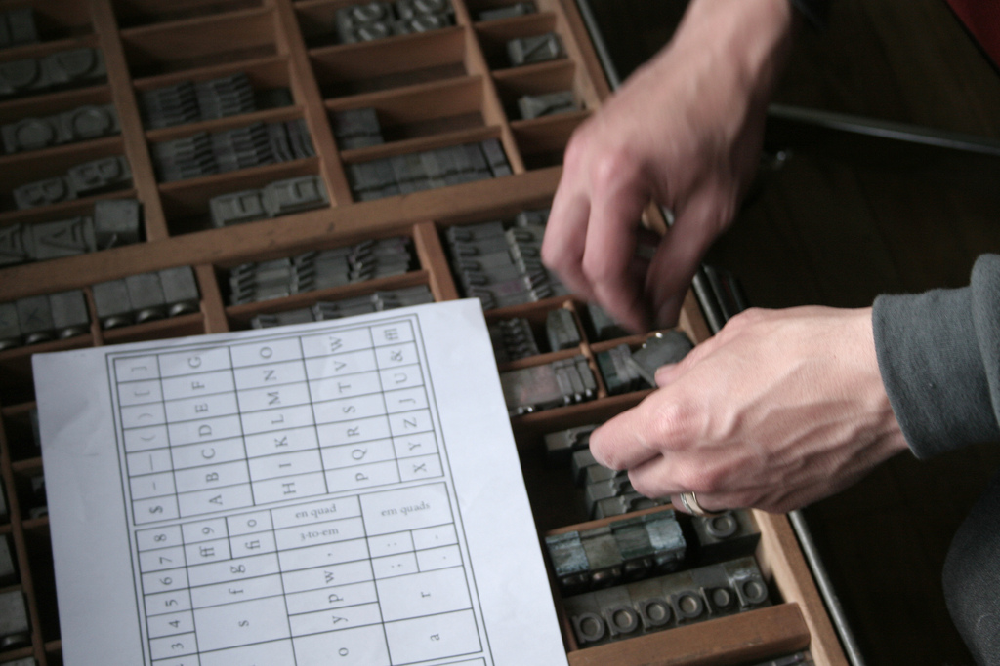
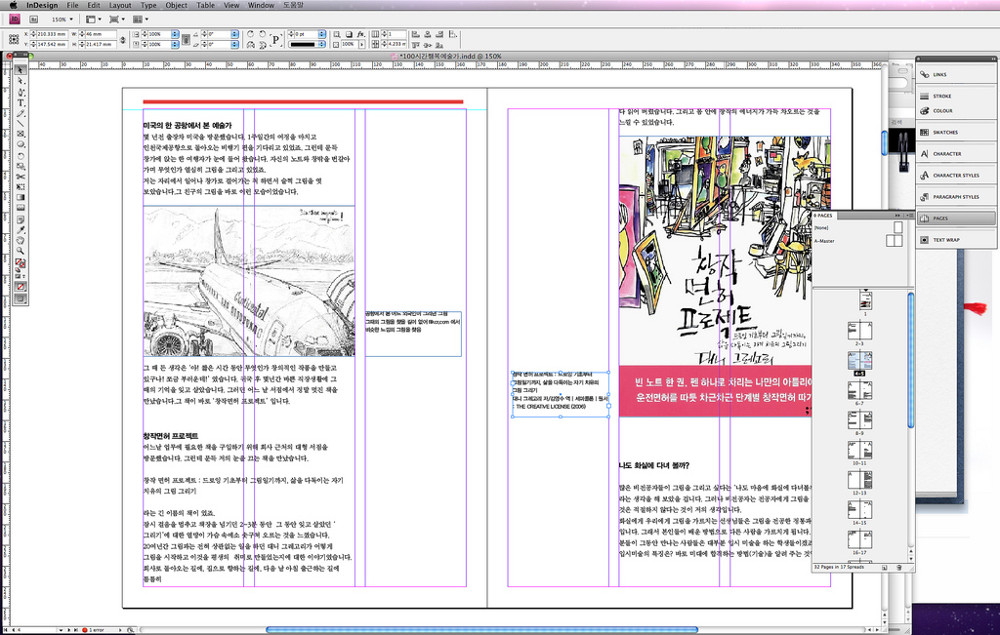

## Schrift…

© Thomas Hawk | https://flic.kr/p/3vkqQ | CC BY-NC 2.0

Note: Am Anfang war das Wort und das wort wurde nicht aufgeschrieben, weil der
Mensch keine Schrift hatte

© Patrick Bürgler | https://flic.kr/p/8K3BrV | CC BY-NC 2.0

Note: Dann wurden Schriftzeichen erfunden um das gesprochene dauerhaft
festzuhalten

© Alice Carrier | https://flic.kr/p/7YvHYQ | CC BY-ND 2.0

Note: Mit dem einzug der Druckerei mit beweglichen Lettern wurde der
schriftsatz zur "schwarzen Kunst" - Fachbegriffen wurden eingeführt, die noch
heute ihre Gültigkeit haben. Einer davon ist "Letter" oder "Type", der eine
"Glyphe" darstellt.

© Jinho Jung | https://flic.kr/p/9ZpTPt | CC BY-SA 2.0

Note: Mittlerweile wird schrift am Computer allgegenwärtig verwendet. Aber wie
wird diese Schrift gespeichert? Im Druck war es die Letter, im Computer können
es nur Zahlen sein.