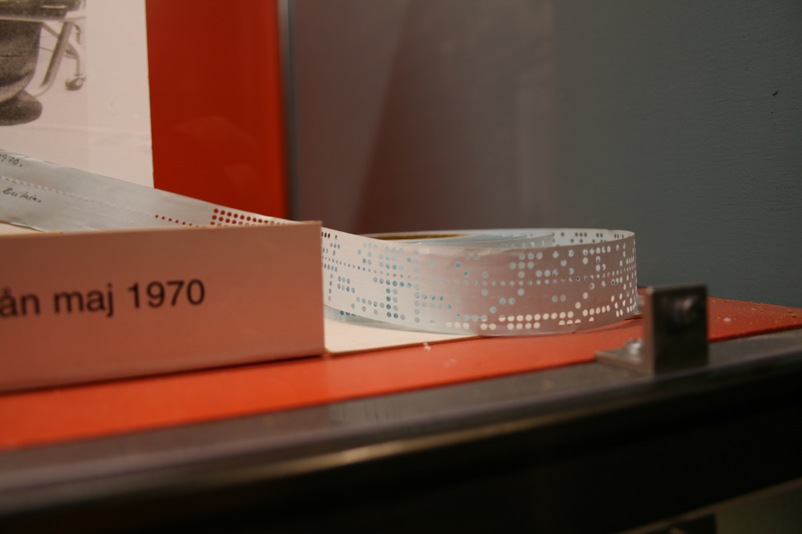

© Jan Andersen | https://flic.kr/p/27tNw5 | CC BY-NC-ND 2.0

Note: Am Anfang war gar keine notwendigkeit für "Schrift", da Informationen binär
in Lochkarten abgelegt wurden. Output war ebrenfalls auf Lochkarten.

## Anfänge

|    |   |
|----|---|
| 01 | A |
| 10 | B |
| 11 | C |

Note: Mit dem Aufkommen von Monitoren ändert sich das. Erste Ansätze zur
Speicherung von Schrift in Zahlen ist der American Standard-Code of Information
Interchange (ASCII) 7-Bit!

## ASCII

|    | x0 | x1 | x2 | x3 | x4 | x5 | x6 | x7 | x8 | x9 | xA | xB | xC | xD | xE | xF |
|----|---| --- | --- | --- | --- | --- | --- | --- | --- | --- | --- | --- | --- | --- | --- | --- |
| 0x |   |   |   |   |   |   |   |   |   |   |   |   |   |   |   |   |
| 1x |   |   |   |   |   |   |   |   |   |   |   |   |   |   |   |   |
| 2x |   |   |   |   |   |   |   |   |   |   |   |   |   |   |   |   |
| 3x |   |   |   |   |   |   |   |   |   |   |   |   |   |   |   |   |
| 4x |   | A | B | C | D | E | F | G | H | I | J | K | L | M | N | O |
| 5x | P | Q | R | s | T | U | V | W | X | Y | Z |   |   |   |   |   |
| 6x |   | a | b | c | d | e | f | g | h | i | j | k | l | m | n | o |
| 7x | p | q | r | s | t | u | v | w | x | y | z |   |   |   |   |   |

Note: Alle Buchstaben vorhanden

## Exkurs

### Groß- und Kleinschreibung

A => 100 0001 <!-- .element: class="fragment" -->

a => 110 0001 <!-- .element: class="fragment" -->

<!-- .slide: data-transition="fade-in" -->
## ASCII

|    | x0 | x1 | x2 | x3 | x4 | x5 | x6 | x7 | x8 | x9 | xA | xB | xC | xD | xE | xF |
|----|---| --- | --- | --- | --- | --- | --- | --- | --- | --- | --- | --- | --- | --- | --- | --- |
| 0x |   |   |   |   |   |   |   |   |   |   |   |   |   |   |   |   |
| 1x |   |   |   |   |   |   |   |   |   |   |   |   |   |   |   |   |
| 2x |   |   |   |   |   |   |   |   |   |   |   |   |   |   |   |   |
| 3x | 0 | 1 | 2 | 3 | 4 | 5 | 6 | 7 | 8 | 9 |   |   |   |   |   |   |
| 4x |   | A | B | C | D | E | F | G | H | I | J | K | L | M | N | O |
| 5x | P | Q | R | s | T | U | V | W | X | Y | Z |   |   |   |   |   |
| 6x |   | a | b | c | d | e | f | g | h | i | j | k | l | m | n | o |
| 7x | p | q | r | s | t | u | v | w | x | y | z |   |   |   |   |   |

Note: plus Zahlen

<!-- .slide: data-transition="fade-in" -->
## ASCII

|   | x0 | x1 | x2 | x3 | x4 | x5 | x6 | x7 | x8 | x9 | xA | xB | xC | xD | xE | xF |
| --- | --- | --- | --- | --- | --- | --- | --- | --- | --- | --- | --- | --- | --- | --- | --- | --- |
| 0x |   |   |   |   |   |   |   |   |   |   |   |   |   |   |   |   |
| 1x |   |   |   |   |   |   |   |   |   |   |   |   |   |   |   |   |
| 2x | SPC | ! | " | # | $ | % | & | ' | ( | ) | * | + | , | - | . | / |
| 3x | 0 | 1 | 2 | 3 | 4 | 5 | 6 | 7 | 8 | 9 | : | ; | < | = | > | ? |
| 4x | @ | A | B | C | D | E | F | G | H | I | J | K | L | M | N | O |
| 5x | P | Q | R | s | T | U | V | W | X | Y | Z | [ | \\ | ] | ^ | _ |
| 6x | \` | a | b | c | d | e | f | g | h | i | j | k | l | m | n | o |
| 7x | p | q | r | s | t | u | v | w | x | y | z | { | ¦ | } | ~ |   |

Note: Plus Sonderzeichen

<!-- .slide: data-transition="fade-in" -->
## ASCII

|   | x0 | x1 | x2 | x3 | x4 | x5 | x6 | x7 | x8 | x9 | xA | xB | xC | xD | xE | xF |
| --- | --- | --- | --- | --- | --- | --- | --- | --- | --- | --- | --- | --- | --- | --- | --- | --- |
| 0x | NUL | SOH | STX | ETX | EOT | ENQ | ACK | BEL | BS | HT | LF | VT | FF | CR | SO | SI |
| 1x | DLE | DC1 | DC2 | DC3 | DC4 | NAK | SYN | ETB | CAN | EM | SUB | ESC | FS | GS | RS | US |
| 2x | SPC | ! | " | # | $ | % | & | ' | ( | ) | * | + | , | - | . | / |
| 3x | 0 | 1 | 2 | 3 | 4 | 5 | 6 | 7 | 8 | 9 | : | ; | < | = | > | ? |
| 4x | @ | A | B | C | D | E | F | G | H | I | J | K | L | M | N | O |
| 5x | P | Q | R | s | T | U | V | W | X | Y | Z | [ | \\ | ] | ^ | _ |
| 6x | \` | a | b | c | d | e | f | g | h | i | j | k | l | m | n | o |
| 7x | p | q | r | s | t | u | v | w | x | y | z | { | ¦ | } | ~ | DEL |

Note:  plus jede Menge Steuerzeichen.

## ASCII

Klasse!
Note: Sch.... ganz schön voll. Achtung: Reine Zuordnung Zahl => Buchstabe. Keine Schrift, keine Glyphen, keine Umlaute etc. Reine Zeichenkodierung!

## ASCII

Aber was w re wenn ...

Note: Und die Briten nerven weil es zwar ein Dollar-Zeichen, aber kein Pfund zeichen gibt. Und platz ist auch nicht mehr