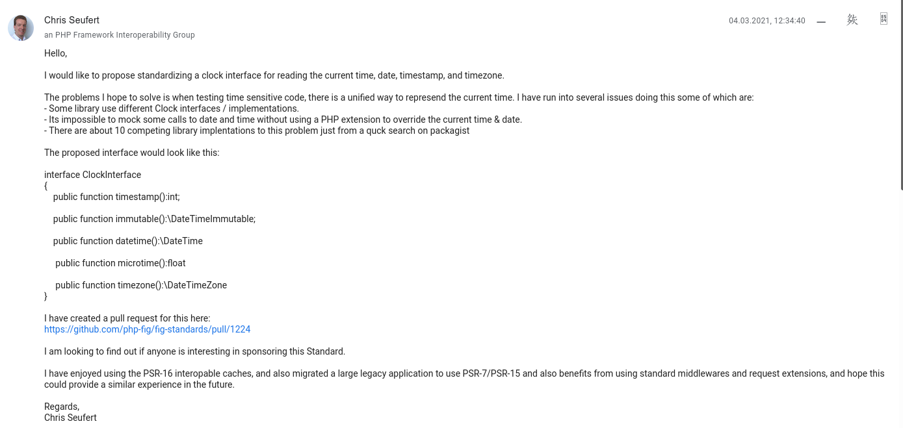

note: This whole thing started with an [email by Chris Seuffert to the PHP-FIG mailinglist](https://groups.google.com/g/php-fig/c/lA8Lz0E4dWk/m/nvafR08MBAAJ) on the 4th of March 2021.
I was in hospital at the time and didn't have anything else to do (apart from requesting
pain medication and trying to walk for mor ethan 50 meters without having to stabilize myself
with the drip stand). And as the idea that Chris proposed targeted timezones I couldn't help
but leap for it.
But before we dive right into how the whole thing evolved, perhaps I should take a step back and first
check what this clock thingy is and why it is a great idea.


## Best Practices

Note: To do so we will have to dive into OP, SOLID and TDD to name a few. To cut things short:
We are talking about "Best Practices" in programming.
TO make one thing clear from the beginning: You do not need a clock to get code out and to solve
a business problem. But as you might hopefully see, it helps you in doing so.
And to make it easier to follow: Let's tackle a kind of real life problem to have some example code and not continue talking about some abstract stuff.


## The Problem

Note: Let's imagine we are challenged with the following task:


> Filter all items that are in the future.

note:Sounds trivial, doesn't it? And yet it is a great way to show some best practices that
can help with that including a clock.
So to start we are given an Iterable that contains items with a datetime information.
Something like this:


```php
/**
 * @var $iterable array<array-key, array{
 *   time: int,
 * }>
 */
$iterable = getItems();
```


## Solution 1
```php
$futureItems = array_filter($iterable, function ($item) {
    return time() < $item['time'];
});
```

Note: That was easy. Commit code, create PR, task finished!
Until someone comes around and doesn't want to merge the PR because there are no tests...
Oh dammit.
I mean: Writing a test for this simple function should be easy, shouldn't it?
Well. It isn't *that* easy as it is right in the middle of some other code. So I have to adapt the test for that other code.
Or I create a separate function that I can more easliy test.
Let's use that second step.


## Solution 2
```php
function filterFutureItems(array $items); array
{
    return array_filter($items, function($item) {
        return time() < $item['time'];
    });
}

$futureItems = filterFutureItems($iterable);
```

Note: Now I can create a test for the `filterFutureItems` function without an issue.


```php
public function testFutureItemsAreFiltered(): void
{
    $items = [
    	['time' => time()-1],
    	['time' => time()],
    	['time' => time()+1],
    ];
    
    $newItems = filterFutureItems($items);
    $this->assertCount(1, $newItems);
}
```
Note: ANd the test works! Out of the box!
<br>Most of the time. But sometimes it doesn't.
<br>Why?
<br>Because there are two rather complicated things in programming and testing it. And in this case those aren't naming cache-invalidation and off-by-one erros.
In this case I'm talking about randomness and the current time. Due to the very nature
of them they are not easy to predict respectively change continuously.
<br>In this case we are only interested in fixing the current time issue.
<br>So how can we fix that? Well. it would be cool to be able to overwrite that function "time" to always return something that we want it to return. And guess what! That's even possible, using namespaces. There is a whole library that allows that with phpunit together. Go for it.
<br>But wait! Before we start to tear apart the basics of our programming language, there migh tbe an easier solution for that!
<br>For one thing: We should stop using functions like `time` or `date` and instead use the awesome object-oriented approach we have in PHP. Instead we can use


## Replace `time` and `date` etc <br>with `DateTimeImmutable`
```php
// time();
(new DateTimeImmutable())->getTimestamp();

// echo date('c');
echo (new DateTimeImmutable())->format('c');
```
Note: which provides us with the same results but some added benefit as we'll see in a second.<br>
So let's rewrite the function a bit


## Updates Solution 2
```php
function filterFutureItems(array $items); array
{
    return array_filter($items, function($item) {
        return (new DateTimeImmutable())->getTimestamp() < $item['time'];
    });
}
```
Note: Hm. One thing that bothers me is that we are instantiating a new DateTimeImmutable object on every iteration.
We already did that before with the call to `time()` which returned a different time with each iteration...
<br>So let's change that a bit:


## improvement
```php
function filterFutureItems(array $items); array
{
	$now = new DateTimeImmutable();
    return array_filter($items, function($item) use ($now) {
        return $now->getTimestamp() < $item['time'];
    });
}
```
Note: But we still have the issue that this is hard to test.
<p>For one thing this function is put somewhere into a list of functions or added somewhere to a class where it – if we are truly honest – not really belongs to.
<p>So let's first make a separate class out of that:


## Extract into class
```php
final class FutureItemFilter
{
    public function filter(array $items): array
    {
        $now = new DateTimeImmutable();
        return array_filter($items, function($item) use ($now) {
            return $now->getTimestamp() < $item['time'];
        });
    }
}
```

Note:Now this code is reusable and separately testable.
<p>We can invoke it now with something like this:


# Invoking the filter
```php
$filter = new FutureItemFilter();
$items = $filter->filter($items);
```
Note: Or we can even go one step further and inject this filter into the calling method using
DependencyInjection like this:


## Inject the filter
```php
class Foo
{
    public function __construct(private FutureItemfilter $filter) {}
    
    public function doSomething()
    {
        $items = $this->getItems();
        $items = $this->filter->filter($items);
    }
}
```
Note: But we still have the issue that writing a test is pretta hard as we have not yet solved the issue
with the ever advancing time.
<p>So perhaps we can use dependency injection here as well?


## further improvement 
```php

final class FutureItemFilter
{
    public function filter(array $items, DateTimeImmutable $now): array
    {
        return array_filter($items, function($item) use ($now){
            return $now->getTimestamp() < $item['time'];
        });
    }
}
```
note: That's much better!
<p>Now we can call it with the appropriate DateTime-object and therefore keep all of that other nonsense away.


## Test
```php
public function testFutureItemsAreFiltered(): void
{
    $items = [
    	['time' => 1],
    	['time' => 2],
    	['time' => 3],
    ];
    
    $filter = new FutureItemsFilter();
    
    $newItems = $filter->filter($items, new DateTimeImmutable('@2'));
    $this->assertCount(1, $newItems);
}
```
note: That's pretty neat.
<p>And also the implementation is rather straight forward:


## Inject filter
```php
class Foo
{
    public function __construct(private FutureItemfilter $filter) {}
    
    public function doSomething()
    {
        $items = $this->getItems();
        $items = $this->filter->filter($items, new DateTimeImmutable());
    }
}
```
Note: But... wait...
<p>Now we have the issue with tsting the `doSomething`method. As we now have outsourced the instantiation of the
DateTime-object to there.
<p>And yes: We could have done the same using an integer with `time()`.
<p>So we can now fix that and move the invocation of the DateTime-instance into the next calling method and so on and so forth.
<p>But at one point we will have to do the instantiation.
<p>How do we handle that with other ressources?


## Factories

Note: Exactly: We use Factories.
<p>What is a factory? It is something that produces something that we need on demand. So we can inject the factory into a class or method and then request the resource when we need it. And when we don't need it no resource has been wasted.
<p>So let's create a factory for a datetime-object:


## Factory
```php
final class CurrentDateTimeFactory
{
    public function getCurrentDateTimeObject(): DateTimeImmutable()
    {
        return new DateTimeImmutable();
    }
}
```
Note: And then let'S use that within the filter.


## Improve filter further
```php
final class FutureItemFilter
{
    public function __construct(private CurrentDateTimeFactory $factory) {}
		
    public function filter(array $items): array
    {
        $factory = $this->factory;
        return array_filter($items, function($item) use ($factory) {
            return $factory->getCurrentDateTime()->getTimestamp() < $item['time'];
        });
    }
}
```
Note: This can now be called like this:


## No change necessary in Foo
```php
class Foo
{
    public function __construct(private FutureItemfilter $filter) {}
    
    public function doSomething()
    {
        $items = $this->getItems();
        $items = $this->filter->filter($items);
    }
}

$f = new Foo(new FutureItemFilter(new CurrentDateTimeFactory()));
$f->doSomething();
```
Note: Does that help us? Not really... As we only have delegated the instantiation to somewhere else but we still depend on that one class.
<p>And we still can not easily inject different DateTime-objects...
<p>Solutions?


# Solution 3


## Interface
```php
interface DateTimeFactoryInterface
{
    public function getCurrentDateTimeObject(): DateTimeImmutable;
}
```


## First implementation:
```php
final class CurrentDateTimeFactory implements DateTimeFactoryInterface
{
    public function getCurrentDateTimeObject(): DateTimeImmutable()
    {
        return new DateTimeImmutable();
    }
}
```
Note: For production usage


## Second Implementation:
```php
final class TestDateTimeFactory implements DateTimeFactoryInterface
{
    public function __construct(private DateTimeImmutable $date) {}
    
    public function getCurrentDateTimeObject(); DateTimeImmutable)(
    {
        return $this->date;
    }
}
```
note: For tests<p>And now let's adapt the filter.


## Adapted Filter
```php
final class FutureItemFilter
{
		public function __construct(
		    private DateTimeFactoryInterface $factory
		) {}
		
    public function filter(array $items): array
    {
        $factory = $this->factory;
        return array_filter($items, function($item) use ($factory) {
            return $factory->getCurrentDateTime()->getTimestamp()
                   <
                   $item['time'];
        });
    }
}
```
Note: You see that the only difference has happened in the contructor.
<p>And now we can instantiate this class in two different ways:


```php
$filterForTestingPurposes = new FutureItemFilter(
    new TestDateTimeFactory(
        new DateTimeImmutable(
            '2022-02-22 12:23:34', 
            new DateTimezone('America/Toronto')
        )
    )
);
$filterForRealLifeApplication = new FutureItemFilter(
    new CurrentDateTimeFactory()
);
```
Note: So now we can configure our DI container to always use the `TestDateTimeFactory` for test-environments and the `CurrentDateTimeFactory` for all other environments.


# Fin
Note: Thats about it.
<p>And what does that all have to do with a clock?
<p>Well... What we just implemented is ... a clock
<p>What does a clock do? You call it (in case of the speaking clock literally) and it tells you the current time.
<p>That'S what we just implemented.
<p>We only need to rename some of the classes and interfaces:


## Rename
```diff
-interface DateTimeFactoryInterface
+interface ClockInterface

-final class CurrentDateTimeFactory
+final class SystemClocck

-final class TestDateTimeFactory
+final class FixedClock
```
Note: and also rename the method that we want to use


```diff

-public function getCurrentDateTime()
+public function now()
```


## Why FIG

Note: So that's pretty cool. And it doesn't seem to be rocket science.
<p>After all the implementation of the clocks itself took us less than 20 lines of code.
<p>So what does the Framework Interoperability group have to do with that?
<p>Well. The thing is, that you can of course create your own implementation of this but wouldn't it be great if you could actually use your favourite DateTimeLibrary with that as well?


## Be interoperable
Note: Like Cronos? Or Carbon? Yes: both of them provide you with a `setTestNow()` method but that actually does not provide isolation and you have to stop the mocking process. And over all you are relying on the environment to make sure that your test can be ran instead of letting your function control it's requirements.
<p>Which is what is often refered to as **Dependency inversion**. Your code does not rely upon the global state but solely on the stuff that is injected into the class/method/function.
<p>So instad of depending on our own abstraction - our own custom build interface – it makes more sense to rely upon a commonly aggreed upon interface that can be fulfilled by different libraries that are already available out there.
<p>And that is where the FIG comes into the whole thing.
<p>The Framework Interoperability group is an organistation that aims to provide interfaces for common problems so that they can be solved independent from a specific framework and allow interoperability between frameworks.
<p>To do so the FIG produces so called PHP Standard Recommendations: In short: PSR. So far there are 22 of them. Some of them are accepted, some are abandoned, some are deprecated and some are in a draft-mode .


## History


## PSR-0: Autoloading (2010)
Note: The first PSR – PSR 0 – was added to the FIGs  github repository in 2010 and changed the way how we built PHP applications by introducing a common way to autoload PHP-Classes. Before that it depended on the used framework (whether third party or self-build) whether and if so how classes were autoloaded. Now we hada common way of doing that so we could much easier create and include third party libraries. Without this common understanding composer would not have been possible and woulnd't probably have seen the light in 2011.


## PSR-4: Autoloading (2013)
Note: Yes, the first PSR was already superseeded by PSR-4 which allowed the usage of Namespaces in 2013 and so in 2014 PSR-0 was marked as deprecated. It is still available in composer.


## PSR-3: Logging
note: And there are many more such solutions to common problems like Caching or Logging (to name a few). And there are also some PSRs that are in Draft mode for years like PSR-5 which targets PHPDoc blocks.


## PSR-6: Caching
note: For PSR-20 I hope that we are not **that** long in a Draft state.
<p>But in the end it all stands and falls with the editor and the sponsor of the PSR. Those are the ones responsible for addressing all issues and finally calling for an acceptance vote to get the PSR accepted.
<p>So: To get back to the beginning:


## How did I get involved

Note: As I already told you: I was in hospital and had nothing else to do.
<p>And the first draft was ... interesting. Chris proposed an interface that had a number of functions. The general idea to have a Clock-Interface was a no-brainer. If I recall correctly no one actually questioned that. The only thing that was questioned - and to be fair: mostly by me - was whether all those methods were necessary.
<p>The first draft contained these methods:


## Initial Proposal
```php
interface CLockInterface
{
    public function timestamp(): int;
    public function immutable(): DateTimeImmutable;
    public function datetime(): DateTime;
    public function microtime(): float;
    public function timezone(): DateTimezone;
}
```

note: When I read this my first thought was a quote from Derick Rethans


> DateTimeImmutable is what DateTime should have been in the first place <br>(Derick Rethans)

Note: The DateTime class has been the cause of so many datetime related issues in PHP that it is hard to keep track to be honest. People tend to forget that the DateTime class is mutable so any change that they are doing on an instance will happen **to that instance**. And as objects are passed by-reference any change to an object done in a function will stay with that object also outside the function. Which has caused nasty bugs.
<p>To avoid that Derik introduced the DateTimeImmutable class in PHP5.5. And wherever we are using Datetimes in PHP we should by now use DateTimeImmutable to avoid mistakes. It makes things much more explicit.
<p>And if you need – for whatever reason – a DateTime-instance, there is always the `DateTime::createFromImmutable()` method that you can use.
<p>So we actually don't really need the `public function datetime(): DateTime;` declaration.


* public function timestamp(): int;
* public function immutable(): DateTimeImmutable;
* ~public function datetime(): DateTime;~
* public function microtime(): float;
* public function timezone(): DateTimezone;

Note: Also the `public function timezone(): DateTimezone;` is not necessary as the timezone is already part of the DateTimeImmutable (and the DateTime) class. So we can skip that one as well.


* public function timestamp(): int;
* public function immutable(): DateTimeImmutable;
* ~public function datetime(): DateTime;~
* public function microtime(): float;
* ~public function timezone(): DateTimezone;~

Note: So we are now left with `timestamp()`, `immutable()` and `microtime()`.


* ~public function timestamp(): int;~
* public function immutable(): DateTimeImmutable;
* ~public function datetime(): DateTime;~
* public function microtime(): float;
* ~public function timezone(): DateTimezone;~

Note: But a DateTimeImmutable-object also has the `getTimestamp()` function which makes sure that you will get the correct unix-epoch timestamp. And that is regardless of the set timezone.


* ~public function timestamp(): int;~
* public function immutable(): DateTimeImmutable;
* ~public function datetime(): DateTime;~
* ~public function microtime(): float;~
* ~public function timezone(): DateTimezone;~

Note: And for the microtime a similar thing applies. You can get the microtime via a call to `(float) DateTimeImmutable::format('U.u');`.
<p>So in essence almost all methods from the interface can be handled in the calling code as needed by just using **one** method from the proposal: `public function immutable(): DateTimeImmutable;`.
<p>So the decission was very soon taken to only have that one method and leave it to the user to actually convert that DateTimeImmutable instance to whatever the user needs.
<p>And renaming that one method from `immutable` to `now` was then only a matter of ... time...
<p>So we were left with a very simple interface like this:


```php
interface ClockInterface
{
    public function now(): DateTimeImmutable;
}
```


## Sleep

Note: Some other questions that popped up regarded the standardization of `sleep()` or `wait()`.
<p>Those were considered to be out of scope for this PSR as they try to solve a different problem than trying to retrieve the current time. That was easy to convey and the people that seen this as an issue to be solved via a FIG-interface are more than welcome to start another PSR.
<p>The interface should only do one thing and that really well. Which is described by the S and the I in SOLID.
<p>So far for the easy things. With those out of our minds we could have started the acceptance vote. But there was still one thing to be clarified:


## 😱 Timezones!!

Note: So far the only restriction that the PSR imposes is that the returned instance has to be a DateTimeImmutable object. It should represent the current time in a production environment. But that is it.
<p>No further restrictions.
<p>And of course it took only (felt) seconds until the question was raised: Why don't we require the returned DateTimeImmutable instance to be in UTC?
<p>And to be honest: The reason why this PSR is not yet accepted is because it is extremely hard to convince people that it is not *necessary* to enforce that.
<p>Yes: I am advocating to store date-time informations of current things like log-informations or creation or modification times and stuff like that in UTC. It indeed makes the most of sense. But storing information and handling information are two different things. And here we are talking about handling the information.
<p>And why should the interface limit use-cases where the timezone is relevant by enforcing once specific timezone? Espechially when a timezone can be enforced via something like


```php
$clock->now()->setTimezone(new DateTimezone('whatever you want'));
```
note: And if you want to get the timestamp from the DateTimeImmutable you will **always** get the timestamp in UTC (as that is the definition of the Epoch timestamp).


## Excursion: What is "now"

<div id="dg-container">
    <div class="dg-wrapper">
        <a href="#"><div>01:30 UTC</div></a>
        <a href="#"><div>03:30 UTC</div></a>
        <a href="#"><div>05:30 UTC</div></a>
        <a href="#"><div>07:30 UTC</div></a>
        <a href="#"><div>09:30 UTC</div></a>
        <a href="#"><div>11:30 UTC</div></a>
        <a href="#"><div>13:30 UTC</div></a>
        <a href="#"><div>15:30 UTC</div></a>
        <a href="#"><div>17:30 UTC</div></a>
        <a href="#"><div>19:30 UTC</div></a>
        <a href="#"><div>21:30 UTC</div></a>
        <a href="#"><div>23:30 UTC</div></a>
    </div>
</div>

Note: "Now" requests a "slice of time". And the slice is one thing. it is unique. How that specific slice is refered to in
a certain location - whether on Montreal or Amsterdam or on Mars is irrelevant. That might become of interest 
when we have to leave the COntext of PHP - persistence, display in the frontend, Message Queuss come to mind
we have to think about that! BUt not while we are within PHP. As we have a ValueObject that handles 
all relevant interactions without us having to know where the specific time is observed.


```php
// When I created the slides
$a = new DateTimeImmutable(
    '2022-02-18T21:08:00', 
    new DateTimeZone('Europe/Berlin')
);
// Now
$b = new DateTimeImmutable();

// Did I prepare the slides in Time?
var_dump($a < $b);
// true
```
Note: I can compare datetimes with one another, I can get the difference between two datetimes etc:
<p>Even comparison against timestamps works easily via `getTimestamp()`.


> Having to know the timezone of a datetime-object is a code-smell for me

Note: So there is no need to *enforce UTC on the interface level*.
<P>That does **explicitly not** mean that you can not enforce UTC on the implementation level! No one is keeping you from using a `UtcClock` or something like that. `lcobucci/clock` and `ergebnis/clock` for example both provide a `SystemClock` that uses a defined timezone like this:


```php
// Set clock to Montreal time
$clock = new SystemClock(new DateTimezone('America/Toronto'));
// Set clock to UTC
$clock = new SystemClock(new DateTimezone('UTC'));
```

Note: So the PSR currently does not limit you to one specific timezone but allows you to choose the one that suits your application best.
<p>And always differentiate between the interface and the actual implementation. The implementation can of course be more strict than the interface. But the strictness of the interface can not be removed by the implementation. That's part of Liskovs substitutionprinciple (The L in SOLID)
<p>And the fact that we can now change the behaviour of userland code by injecting a different kind of Clock we are fulfilling the Open-Closed principle (The O of SOLID)


# Next Steps

* Bringing the PSR into Acceptance Vote
* Announce GA on Twitter/Discord/MailingList

Note: So bringing this PSR into the acceptance vote is now the next step that we are trying to get to. Originally I had my hopes high that we would have already an accepted PSR but too much time has passed to get to that right now. And as we all are doing this in our spare time, life – as usual – got into the way.
<p>So I can currently not tell you when you will be able to actually **use** the PSR-20 but I have my hopes up high that it will be in the first half of this year.
<p>There are already some libraries advertising themselves as capable of implemting PSR20 though: Check https://packagist.org/providers/psr/clock-implementation
<P>To know exactly: Follow the FIG on twitter, on discord or on their mailinglist. And I'm pretty sure that **I** will also tweet about it once it happened!
<p>So to wrap up with the whole thing, let me give you a short overview of what the interface actually will look like and how you can make use of it:


```php
interface ClockInterface
{
    public function now(): DateTimeImmutable;
}

class Foo {
    public function __construct(private ClockInterface $clock) {}
    
    public function doSomething(): void
    {
        /* @var DateTimeImmutable */
        $now = $this->clock->now();
        // Do whatever needs to be done
    }
}
```


# Questions?


# Thank You!


## Links:

* https://www.php-fig.org/psr/#draft
* https://github.com/php-fig/fig-standards/blob/master/proposed/clock.md
* https://github.com/php-fig/fig-standards/blob/master/proposed/clock-meta.md
* https://packagist.org/providers/psr/clock-implementation
* https://groups.google.com/g/php-fig/c/lA8Lz0E4dWk/m/nvafR08MBAAJ
* https://discord.gg/php-fig
* https://discord.com/channels/788815898948665366/818850995186171918
* https://twitter.com/phpfig
