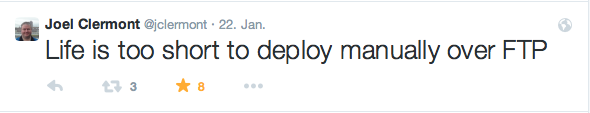

# So far we have

* written unittests
* written code
* passed tests
* checked into VCS
* run continuous integration
* everything is green

# and now?

# How does your code appear on the web server?

# You know this comment?

    /**
     * Here a miracle has to happen
     */

# Requirements

* bring the complete website somehow to the live-server(s)
* keep current configuration files
* easily add new configuration parameters
* resolve dependencies
* skip unnecessary files (docs and such like consume bandwith)
* without additional tools on the webserver (security)

# Available tools

* (S)FTP
* rsync
* SSH
* VCS
* DependencyManagement
* automation tools

## (S)FTP

* Easy
* well known
* widely adopted
* insecure (without "S")
* timeconsuming
* way to 1990s ;-)

## rsync

* bit more complex
* not available on every hosted system

## SSH

* not available on every hosted system
* just remote terminal session
* depends on tools on the remote end

## VCS

* just stores the files
* no easy automated way to push data to a known repo

## Dependency Management

* composer
* bower
* ...

Doesn't push data somewhere

## Automation Tools

* phing
* ant
* grunt
* ...

# Ways to deploy

* "Old School" push
* rsync
* pull on server
* VCS-push
* "New School" push

## "Old school" push

Copy your stuff onto the machine via (s)ftp, configure everything

* (S)FTP onto the server
* upload the content of your site-folder
* adapt config files
* be happy
* NEVER CHANGE

## RSYNC

Install on a staging machine and sync it's content onto the live machine

* Have a second machine
* Deploy there (by hand)
* rsync the content to the live machine
* be happy
* Config has to be the same, otherwise config files can't be synced
* hope that no one breaks anything as rsync-config can be fragile w/h access-rights

## pull on server

Check out on the live machine right from your VCS

* VCS-cient on the server
* firewall-holes
* build-process on the live-server (composer, bower etc)

## VCS-push

Pushing to your VCS triggers push to second VCS-Server which in turn triggers a
checkout from that VCS

* VCS-client on the server
* build-process on the live-server (composer, bower etc)

## "New School" push

Use a tool like Capistrano or Rocketeer to collect everything and do the push.

* Might require different software (Capistrano/Ruby)
* another dependency
* specific setup required
* config-files?

# What's **your** setup?