# A healthy mind in a healthy body
Note: Usually this is associated with a helathy body causing a healthy mind. Take care of your body and the rest will follow.
Apart from this sentence being a satire in the beginning: orandum est ut sit mens sana in corpore sano

# orandum est ut sit mens sana in corpore sano
Note: Roman poet Juvenal: You should pray for a healthy mind in a healthy body. And not for things like long life. 
And besides: A healthy body says nothing about your mental abilities.

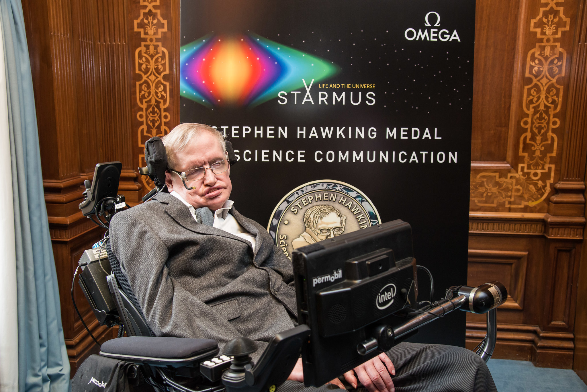
Note: It is much more that there is no health without mental health.

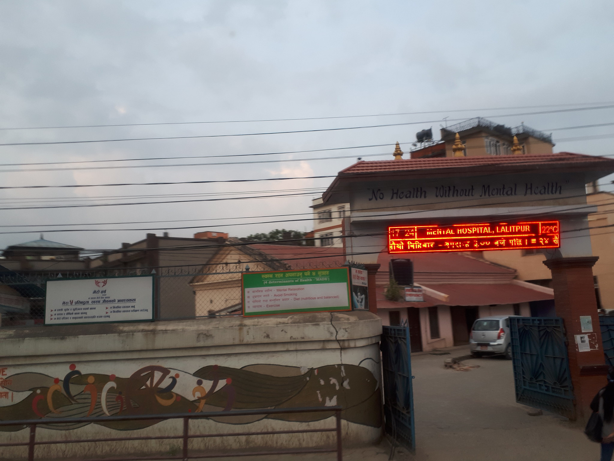
Note: what does that tell us about the so often cited Work-Life balance

# Work-Life Balance
Note: I'm sure there is no such thing as A work-life balance

# ~~Work-Life Balance~~

## There is no separation between Work an Life
## (personal opinion)

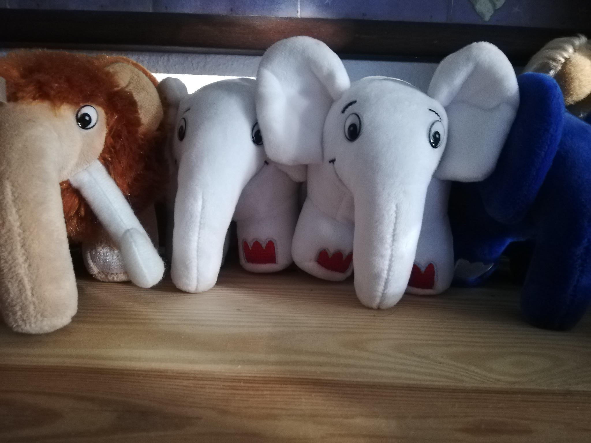
Note: Life always interferes. We've seen that during corona. Suddenly everyone is working from home during a pandemic and the kids/pets/partners/flatmates/ whoever 
suddenly interfere. During "normal" work-times the traffic-jam interferes. Not to talk about your mind wandering of due to the
last 15 invoices that you have to somehow pay or the recent mobbing events in your juniors school (not to talk about shootings or similar)
or what about that nice flirt last evening that completely turns your mind upside down. Can you concentrate on your work?
See: Live interferes in multiple ways. 

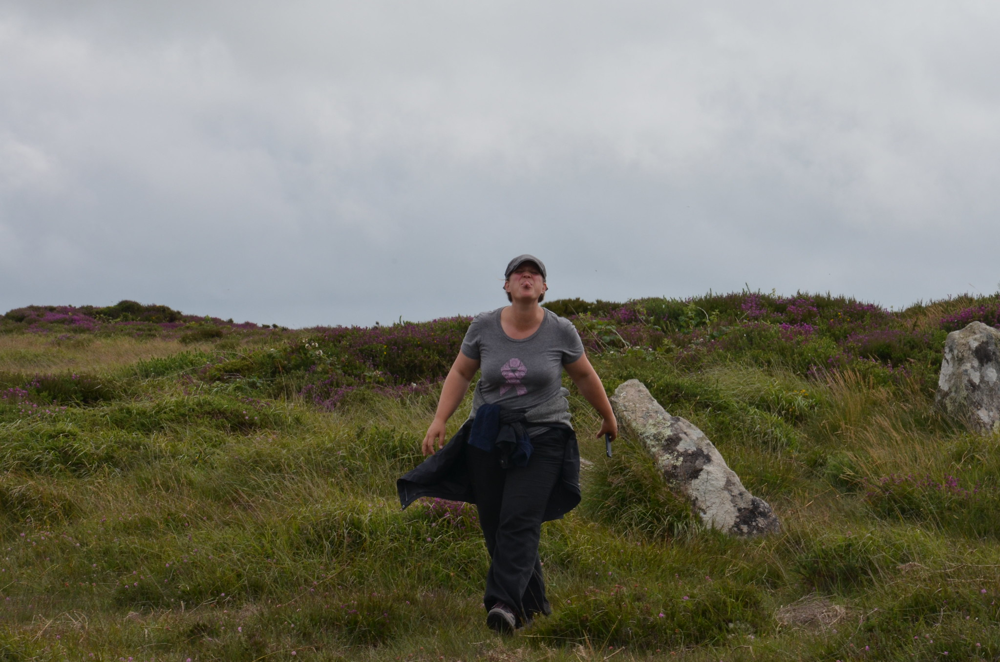
Note: And for me 2020 was a bad boy. Wife got diagnosed with BoneCancer. Metastasis of her breast cancer 
that she fought 5 years ago. And suddenly my brain was occupied with completely other things. Death is not something 
far away and distant. It is part of our daily life. How long do we have? (No one will answer that but probably more 
than 3 years) What do we have to do now? Sort out all the things you keep saying you'll do "one day". That day has come!
Luckilly we already had our last wills and our living wills sorted some years ago due to the last surgery caused by 
breast cancer (Yay!!). But how do you tell your kids? In a way that they don't break? Suddenly so much was on my mind,
that my "professional" work life was influenced! Immensly. And IMO people have a right to know why I'm suddenly 
different.

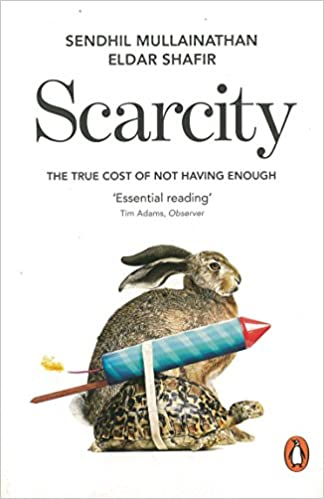

Note: Our mind does interesting things. It doesn't work like a computer. It works to keep us alive. And sometimes that 
means taking shortcuts. I'm not going to go into too much detail on that topic. but it illustrates why in my opinion 
there is no separation between private and professional life is possible as the private life will always influence the professional life.
So if we can not separate the two. What else to do?

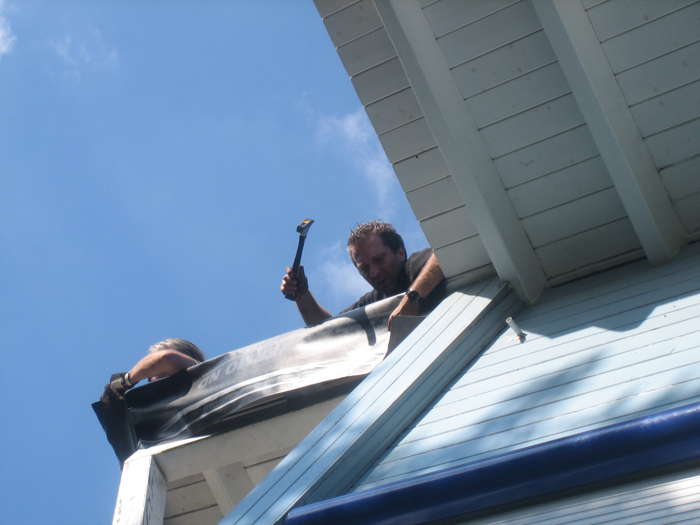
Note: I very soon realized that I had to unite work and private life. In my first job I was 9 hours together with my colleagues but only some 
6 hours with my family. (I'm not counting sleep here...) ;-) So I spent more time with my colleagues than with my wife!
And during that time we shared more than the happy stories. Of course they realized when something was brewing. Of course 
they asked. So we shared. And helped each other. 

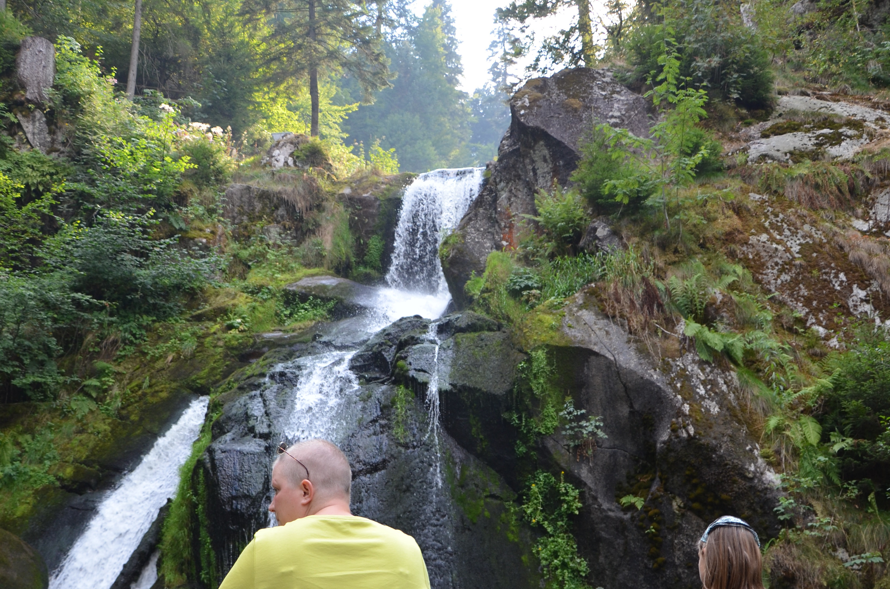
Note: It means opening up. It makes you vulnerable! It allows others to use your vulnerability against you. 
And there are those that will! I live right next door to such individuals. It is hell! They will call you names. And 
they will not stop until you go mad. And then they realize that they were successfull and that it's the way to tease you...
Bullies. But most of the people do not want to see you fail! They want to see you succeed! They will help you.

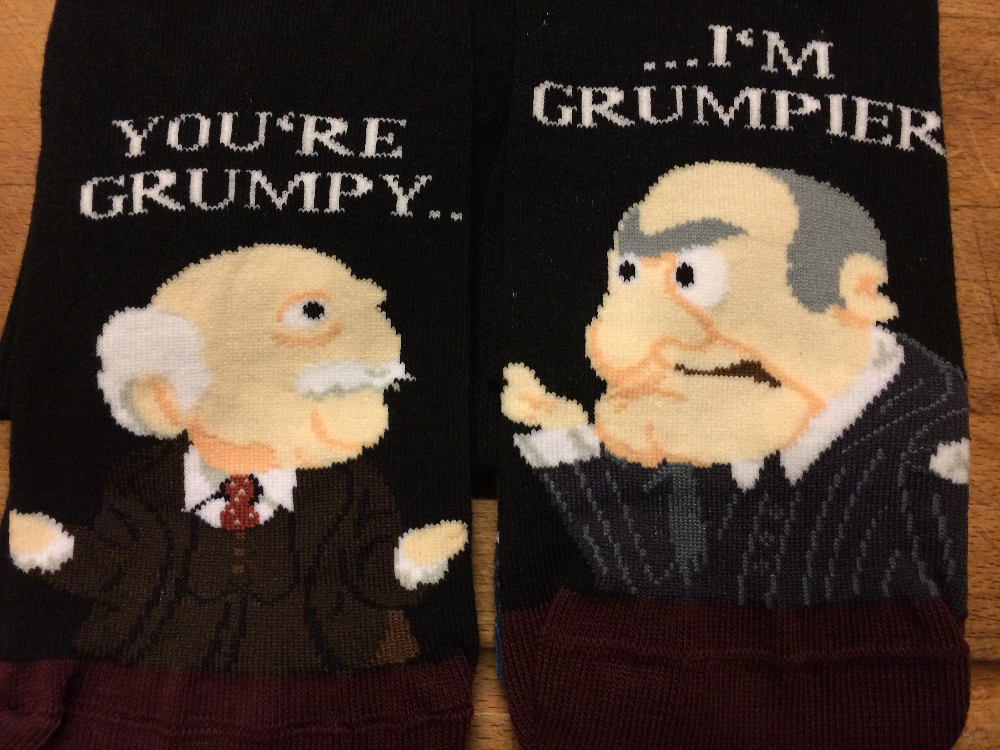
Note: In that time we realized who the friends are that we can actually count on. The friends that you can call at 4 in 
the morning are the ones you can count on. And they came from spots we never thought off. Accept them. When they come over 
with food, say.

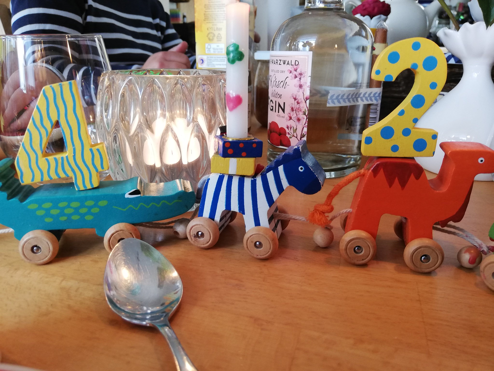
Note: If good things happen to you: Say Thank You! No But! Accept gifts without putting them into perspective. Try it.
Next time someone does something nice to you, say: Thank you. Without a but or without feeling of guilt that you do not deserve it. 
You do! And then off to the next level A lot of people approached us with some kind of variation of "call me if I can help". The previous people were the ones
that just helped. They knew us and did something that needed doing. (Thanks Stephan and the whole Dutch PHP COmmunity at this point!!!)
And it doesn't matter whether I say THank you at work or in private. 

Note: Ask the people for help! That's even harder and for some it is the holy grail. Thank you stefan for causing me to finally
read "The Art of Asking". It opened up a huge spectrum of new ideas. If you have not yet read the book: I encourage you to do so. 
Here as well: Asking for help is not limited to your private life. Why not ask for help at work? "I did not understand 
that, can you explain that in more detail?" And I don'T know how often that question in a customer meeting made us all 
– including the customer – realize that there is a weak spot in the requirement. One where the customer themselves often 
had to admit that there was something missing.

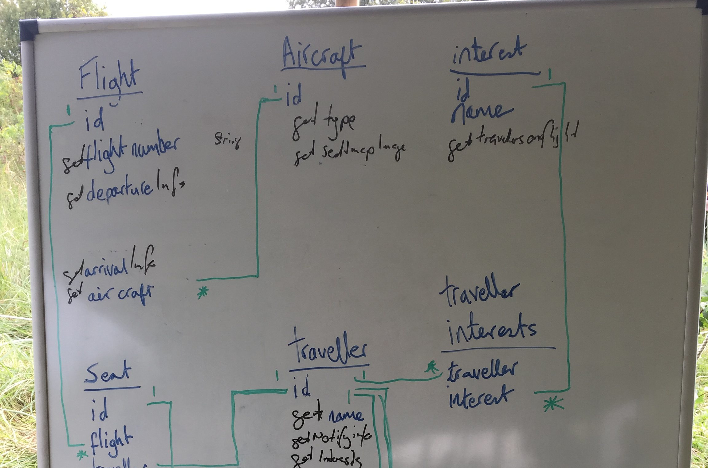
Note: Which brings me to the next point: Failure. What is a failure. it'S when you do not match up to expectations. Who's 
expectations? For me it was very often my own expectations. With a sick wife and two kids with their respective needs,
expectations suddenly shift. And what I previously considered as failure suddenly became a tiny nuisance or not relevant at all anymore. 

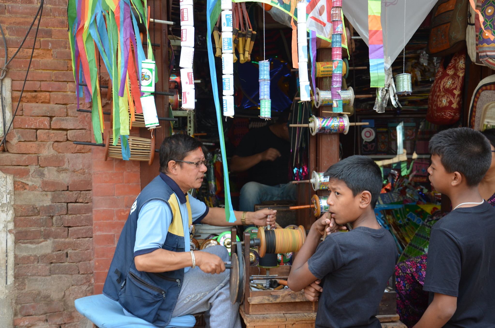
Note: KiteRope - What is important to you? What is important? Cancer for sure sucks. But thank goodness we live in Germany! I do not 
need to worry about my financial situation just because that B$tch decided to hit us like people elsewhere. And then I 
had the opportunity to visit SouthAfrica and shortly afterwards Nepal and suddenly even that first world approach was washed away.
It'S not about "There'S always someone worse", it's about realizing how much luck I have. And when I have seen how people 
that have nothing share that little they have with a smile that was the point that I realized that staying positive is a great helper

Note: There is always a positive side. A road is blocked? YOu can see a different area. No Pizza Hawaii? Get a real pizza!

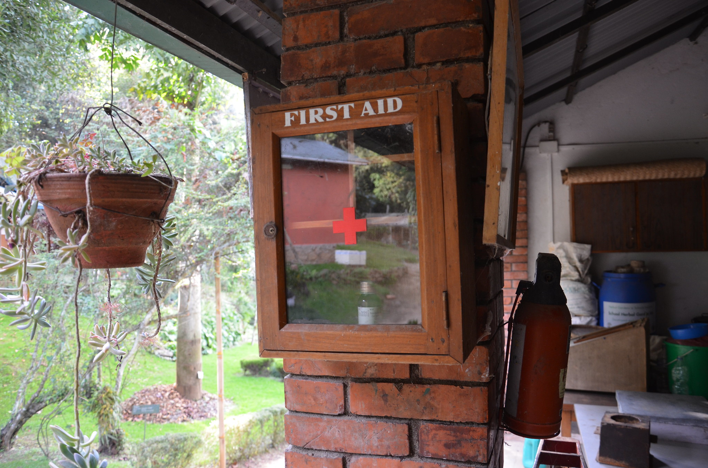
Note: Your misogynistic Nazi-neighbour? Awesome! A negative Role Model! You are going to die before your parents? Cool! You 
don'T have to worry about their inheritance...

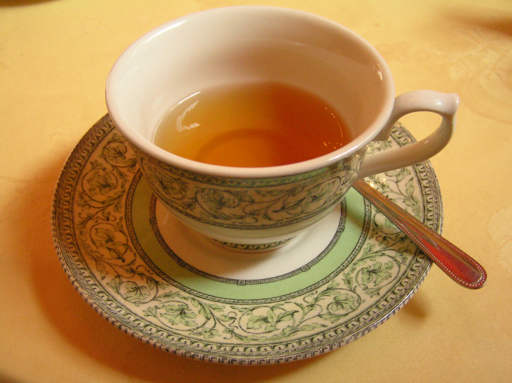
Note: Most importantly for me: See everything as a chance! It doesn't matter whether the tea is half empty or half 
full. It is a chance to either get a new one (if it is a good evening) or not (if it is a bad one). Or get a coffee. 
Or if it is an exceptionally good one, to take every remaining sip very consciously and enjoy every single drop. 

Note: So to get back to the beginning: For me there is no work-life balance as it is one. My life is part of my work and my 
work is part of my life. And should I separate work and life: Where does the PHP-Community fit in? People from
all over the world that became friends? That know secrets that my family doesn't know. Is that work? Or is that Life?
Where does this comference fit into? How shall I separate Work and Life. Me that made their hobby their profession... 
(perhaps one shouldn't do that)...

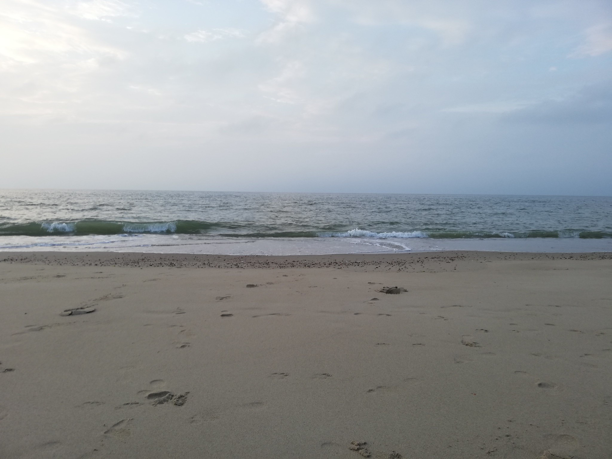
Note: And yes! Loss is inevitable. But that is the only thing that is absolutely certain in life. We now know that it
will come rather sooner than later. So we can prepare. We now try to make every sip count. And I concentrate more on
my family than previously. Because I expect to have much less time with the woman I love than I expect to be able to work

Thank you!

