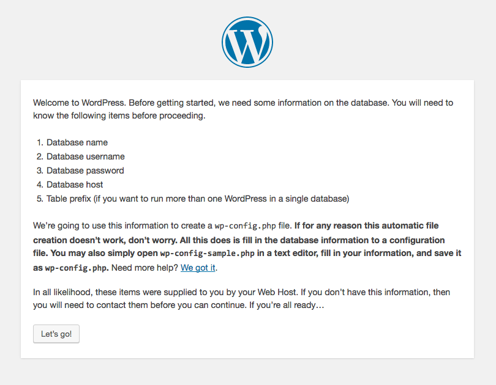

# Bootstrapping WordPress

## Hi, I'm Andreas

* Workflow-Integrator @ Germanys #1 Corporate Publisher
* OSS-Contributor
* Maintainer of different OSS-libraries & WordPress-plugins
* Co-Organizer of [PHPUGFFM](http://phpugffm.de)
* Head behind [php.ug](https://php.ug)

[andreas@heigl.org](mailto:andreas@heigl.org) | [@heiglandreas](https://twitter.com/heiglandreas) | [andreas.heigl.org](http://andreas.heigl.org)

Note: I've done numerous installations of WordPress so far.

## The 5 Minute Installer

* <!-- .element: class="fragment" -->awesome piece of code
* <!-- .element: class="fragment" -->one reason for the wide adoption of wordpress
* <!-- .element: class="fragment" -->easy installation on shared hosting
* <!-- .element: class="fragment" -->Difficult to automate
* <!-- .element: class="fragment" -->Complicated to manage multiple instances

## The Idea

Creating and manage a multistaged WordPress-site with a few simple automatable commands<!-- .element: class="fragment" -->
