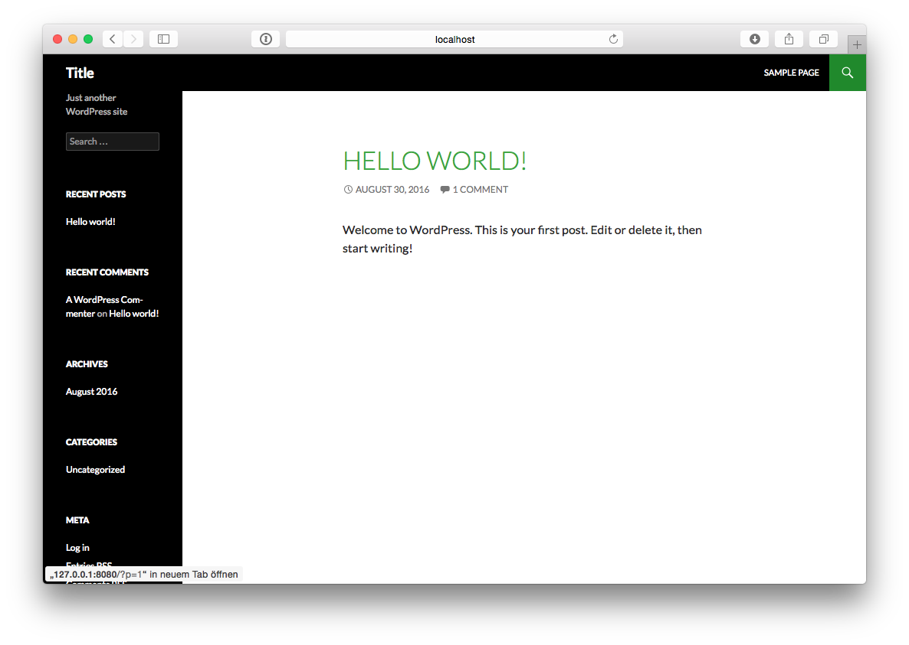

## Version Control

> Don't keep dependencies in Version Control!

Whatever you like: git, mercury, svn, ...<!-- .element: class="fragment" -->

I prefer git<!-- .element: class="fragment" -->


## Folder Layout

* wp <!-- .element: class="fragment" --><span style="color: red">✗</span><!-- .element: class="fragment" -->
* plugins <!-- .element: class="fragment" --><span style="color: red">✗</span><!-- .element: class="fragment" -->
* themes <!-- .element: class="fragment" --><span style="color: red">✗</span><!-- .element: class="fragment" -->
* content <!-- .element: class="fragment" --><span style="color: red">✗</span><!-- .element: class="fragment" -->
* content/themes => themes <!-- .element: class="fragment" --> <span style="color: green">✓</span><!-- .element: class="fragment" -->
* wp-config.php <!-- .element: class="fragment" --><span style="color: red">✗</span><!-- .element: class="fragment" -->
* wp-config.php.dist <!-- .element: class="fragment" --> <span style="color: green">✓</span><!-- .element: class="fragment" -->
* index.php <!-- .element: class="fragment" --> <span style="color: green">✓</span><!-- .element: class="fragment" -->
* config <!-- .element: class="fragment" --> <span style="color: green">✓</span><!-- .element: class="fragment" -->
* .gitignore | .svnignore | … <!-- .element: class="fragment" --> <span style="color: green">✓</span><!-- .element: class="fragment" -->


> But… <br>
> My Theme?


## Your Child-Theme makes up your site

Manage it in a subfolder<!-- .element: class="fragment" -->

Version that subfolder<!-- .element: class="fragment" -->


## Package-Manager

<!-- .element: class="fragment" -->


## composer

* <!-- .element: class="fragment" -->Manage Dependencies (and much more) via a ```composer.json```-File
* <!-- .element: class="fragment" -->Keeps track of currently installed dependencies in a ```composer.lock```-File
* <!-- .element: class="fragment" -->Reads packages by default from [packagist.org](http://packagist.org)


## [wpackagist.org](http://wpackagist.org)

<!-- .element: class="fragment" --> By [Outlandish](http://outlandish.com)

<!-- .element: class="fragment" -->Mirrors WordPress-plugins and -themes as composer-repository


## [WordPress-core-installer](https://github.com/johnpbloch/wordpress-core-installer)

<!-- .element: class="fragment" -->By [John P. Bloch](https://github.com/johnpbloch)

<!-- .element: class="fragment" -->Adds a custom installer for WordPress to composer


## Looks complicated?
    
<pre><code class="hljs elixir">$ composer create org_heigl/wordpress_bootstrap my_folder</code></pre><!-- .element: class="fragment" -->


<video><source src="../base/video/video.mp4" type="video/mp4"></video





## And then?

* <!-- .element: class="fragment" -->Use the UI to add and configure your plugins and themes
* <!-- .element: class="fragment" -->Create one or more WP-CFM-Bundles
* <!-- .element: class="fragment" -->Add the necessary files to your Version Control
* <!-- .element: class="fragment" -->Check them out on your other servers
* <!-- .element: class="fragment" -->Call ```composer install```
* <!-- .element: class="fragment" -->Call ```composer run-script post-create-project-cmd``` (once)
* <!-- .element: class="fragment" -->Adapt the created ```wp-config.php``` (once)
* <!-- .element: class="fragment" -->install a hook to run ```composer install``` after merge
* <!-- .element: class="fragment" -->...


## How does it work?

* WordPress-Constants
* wp-cli
* wp-cfm
* talkToComposer
* composer


## WordPress-Constants

* <!-- .element: class="fragment" -->WP_SITEURL
* <!-- .element: class="fragment" -->WP_HOME
* <!-- .element: class="fragment" -->WP_CONTENT_DIR/_URL
* <!-- .element: class="fragment" -->WP_PLUGIN_DIR/_URL


## System-Quirks

<!-- .element: class="fragment" -->Symbolic link for themes


## [wp-cli](http://wp-cli.org)

Command-Line interface to WordPress

* <!-- .element: class="fragment" -->After first install: Run ``` wp core install```
* <!-- .element: class="fragment" -->After first install: Run ``` wp plugin activate``` for all plugins
* <!-- .element: class="fragment" -->After first install: Run ``` wp theme activate``` for the one theme


## [wp-cfm](http://forumone.github.io/wp-cfm/)

Configuration-Management Plugin

<!-- .element: class="fragment" -->Integrates nicely with wp-cli
<!-- .element: class="fragment" -->After each merge: Run ```wp config pull``` for every config-file


## [talkToComposer](https://github.com/heiglandreas/wp_talkToComposer)

Adds plugins and themes to ```composer.json```

<!-- .element: class="fragment" -->Every time you *activate* a plugin or theme 
it's added to the ```composer.json``` and ```composer.lock```
<!-- .element: class="fragment" -->Every time you *deactivate* a plugin or theme 
it shall be removed from the ```composer.json``` and ```composer.lock```


# weak spots

* <!-- .element: class="fragment" -->WP-CLI currently does not allow automated creation of bundles
* <!-- .element: class="fragment" -->Dev-Environment only available via vagrant
* <!-- .element: class="fragment" -->High Bus-Factor
* <!-- .element: class="fragment" -->No way of moving content between stages    


# Other Systems

There are some other systems out there that are mostly based on the same tools 
(WordPress-core-installer and wpackagist) but up to now none including Config-Management

* https://github.com/76design/wordpress-base
* https://davidwinter.me/install-and-manage-wordpress-with-composer/
* https://roots.io/using-composer-with-wordpress/
* https://github.com/johnpbloch/wordpress-core-installer
* http://composer.rarst.net/recipe/site-stack
* https://github.com/wecodemore/wpstarter

