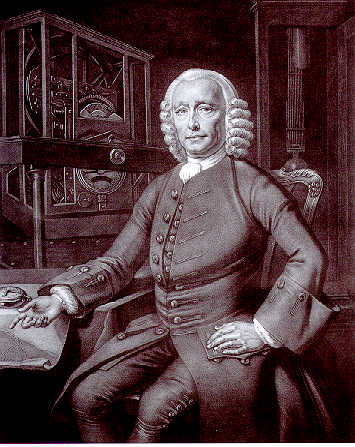
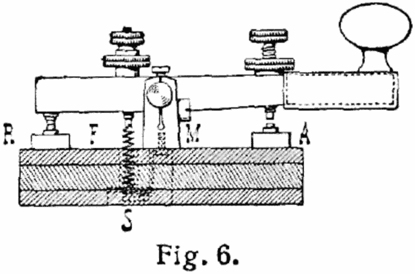

By Benito Mercade y Fabregas - http://nobility.org/2011/10/10/admiral-knighted-duke-of-veraguas/, Public Domain, https://commons.wikimedia.org/w/index.php?curid=17318823

Note: Then traveling became of interest due to colonialisation and the realization that
the world wasn't a disc but a sphere....

Von Hafenbar aus der deutschsprachigen Wikipedia, CC BY-SA 3.0, https://commons.wikimedia.org/w/index.php?curid=15750138

Note: While it was pretty easy to know the distance from the equator by determining
the height of the sun at it's highest point at noon the longitude was imensly tricky.
Therefore sea travel was always a bit of a risk.

By LiveRail - Photographed in National Maritime Museum, LondonPreviously published: Not previosly published, CC BY-SA 3.0, https://commons.wikimedia.org/w/index.php?curid=37705776

Note: in 1714 A price was donated for relialby determining the longitude by the british
parliament. 2 different ideas where followed: first trying to determine the longitude by astronomical
information like what stars where hidden by the moon. Clearly that works only at
clear nights...

By Philippe Joseph Tassaert (1732-1803)After Thomas King († circa 1796) [1767 painting] - [1], Public Domain, https://commons.wikimedia.org/w/index.php?curid=318112

Note: John Harrison tried to determine the longitude using accurate clocks. The idea was to
determine how large the time-difference between local noon and noon at a known reference
point was. For that the ships had to carry a clock that measured the
reference-time with a decent accuracy. The reference-point was greenwich for the british.
But that didn't lead to timezones. Time was still measured by localtime.
And then came an invention by a mister Watt

Note: Scottish inventor

© Chris Allen, CC BY-SA 2.0, https://commons.wikimedia.org/w/index.php?curid=2308677

Note: But these monstrous engines weren't the cause. But as today, everything can
be minified: And suddenly it was possible to put such a montrosity onto a carriage.

Von William M. Connolley (Diskussion · Beiträge) - Diese Datei hat keine Quelle.Bitte ergänze die Dateibeschreibung und gib eine Quelle an.Übertragen aus en.wikipedia nach Commons mithilfe des CommonsHelper / PushForCommons., CC BY-SA 3.0, https://commons.wikimedia.org/w/index.php?curid=1233520

Note: First reliable steam-engine from 1829. Suddenly travel was faster than lokal time. To get a reliable timetable one had to define a
normal time. That was usually the time of the capital. And that time was (and sometimes still is)
used to define timetables.

Note: Trouble were cities where more than one railway ended. Some trains arrive by timenormal a
while others arive by timebnormal b while they might have their own timenormal...
Example: Lake Constance with 5 different times.

Public Domain, https://commons.wikimedia.org/w/index.php?curid=402251
Note: How was that time distributed? By means of telegraphs.

Note: The connection of the eastern and the western railway in the US to the
transcontinental railway caused the railway-companies to define timezones.
Later those where adopted by the governments

By JoeSmack - Own work, CC BY-SA 3.0, https://commons.wikimedia.org/w/index.php?curid=4430864

