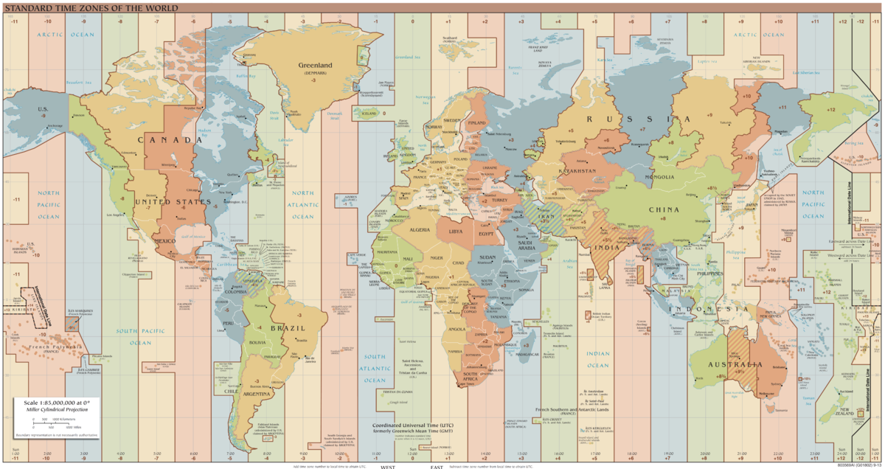
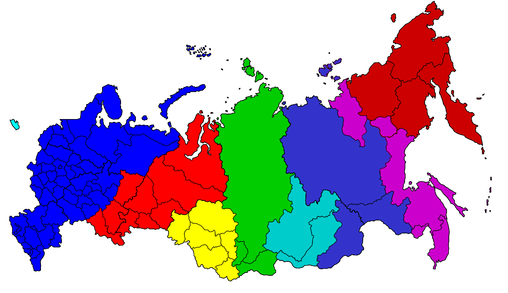
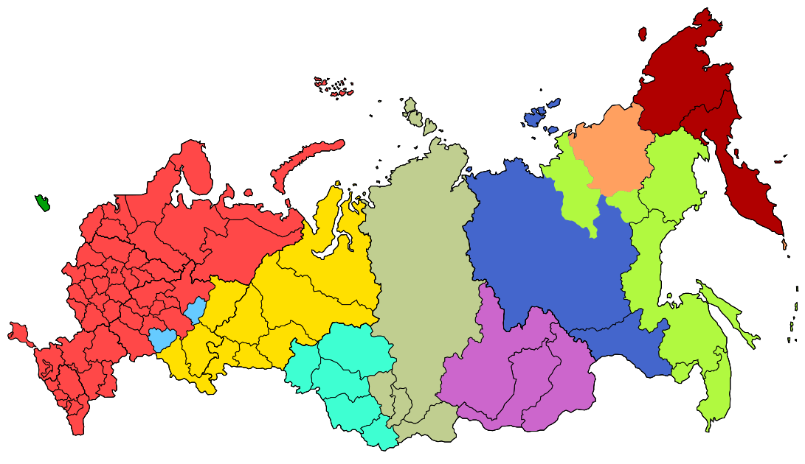

> A timezone is that part of the earthsurface that by governmental definition has the same
date and time

Note: Most timezones are now offset from UTC by full hours, though there are exceptions like nepal (4.25) or venezuela (-4.5)

## Excursion Time Coordinates

### GMT

* Noon depends on sun.<!-- .element: class="fragment" -->
* Offset of up to 16 minutes due differences in the earths rotation<!-- .element: class="fragment" -->

Note: Offset egalises itself throughout the year.

### UT/TAI

* Depends on atomic clocks.<!-- .element: class="fragment" -->
* Started 1955<!-- .element: class="fragment" -->
* Independent from solar orbit<!-- .element: class="fragment" -->
* Offset of 36 seconds as of 30th of June 2015 against UTC<!-- .element: class="fragment" -->

Note: Temps atomic international

### UTC

* Based on TAI<!-- .element: class="fragment" -->
* Started in 1961<!-- .element: class="fragment" -->
* adds leap seconds every now and then<!-- .element: class="fragment" -->
* offset between UTC and GMT max. 0.9 seconds<!-- .element: class="fragment" -->

Note: Started to become base of Timezone offsets from 1972

Von TimeZonesBoy - Eigenes Werk, CC-BY-SA 4.0, https://commons.wikimedia.org/w/index.php?curid=42165217

Note: Offsets are written with + or - depending whether they are right or left of the 0.

## Caveat

* Timezone - Sum of geographical region that shares the same coordinated time.
* Zonetime - The timeoffset against UTC (or GMT) of a geographical region

## To make it more complex

## Timezones change

By Map_of_Russia_-_Time_Zones_(September_2011).svg: Lokal Profilderivative work: TZ master (talk) - Map_of_Russia_-_Time_Zones_(September_2011).svg, CC BY-SA 2.5, https://commons.wikimedia.org/w/index.php?curid=16761048

By PlatonPskov, CC BY-SA 2.5, https://commons.wikimedia.org/w/index.php?curid=33798576

Note: Crimean anexion in 2014, During WW2 in Germany, Political reasons (Venezuela 2014)

100 Years of<!-- .element: class="fragment" -->
## Summertime

Note: To save energie as because the human activity-cycle is offset to the daylight cycle
Summertime was "invented". Offsets the time 1 hour plus against default time-coordinate.
In germany in 1944 there was even 2 summertimes. Start of summertime is coordinated
but not the same in europe and america... 30 April 1916 Detusches Reich

##Summary

* Timezones are political definitions<!-- .element: class="fragment" -->
* Timezones change<!-- .element: class="fragment" -->
* Timezones cover a stripe from northpole to southpole<!-- .element: class="fragment" -->
* Zonetimes are defined by the offset from UTC<!-- .element: class="fragment" -->
* Summertime may add an hour to the Zonetime<!-- .element: class="fragment" -->
* Summertime does not change the timezone but the zonetime<!-- .element: class="fragment" -->

# &lt;/basics><?php