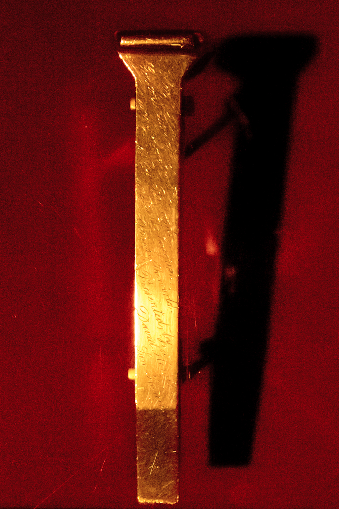
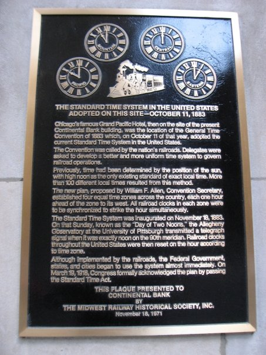

By Wjenning - Own work, CC BY-SA 3.0, https://commons.wikimedia.org/w/index.php?curid=21960146

Note: This is the beginning of timezones

Note: The connection of the eastern and the western railway in the US to the
transcontinental railway caused the railway-companies to define timezones.
Later those where adopted by the governments

By JoeSmack - Own work, CC BY-SA 3.0, https://commons.wikimedia.org/w/index.php?curid=4430864

Note: Why is that necessary?