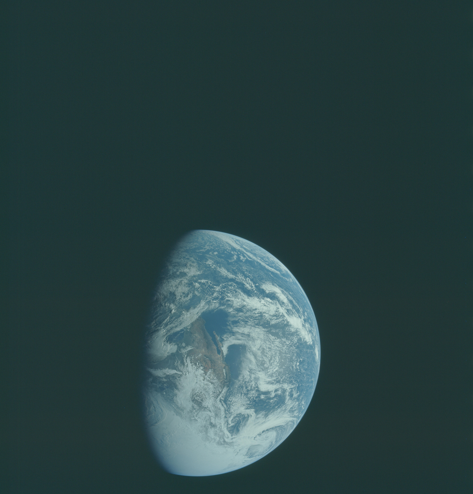
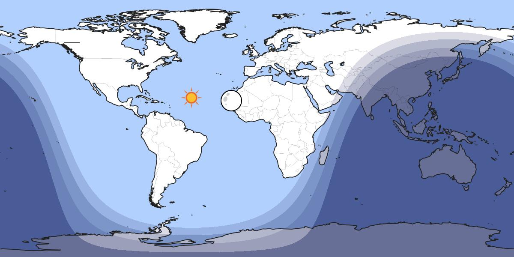
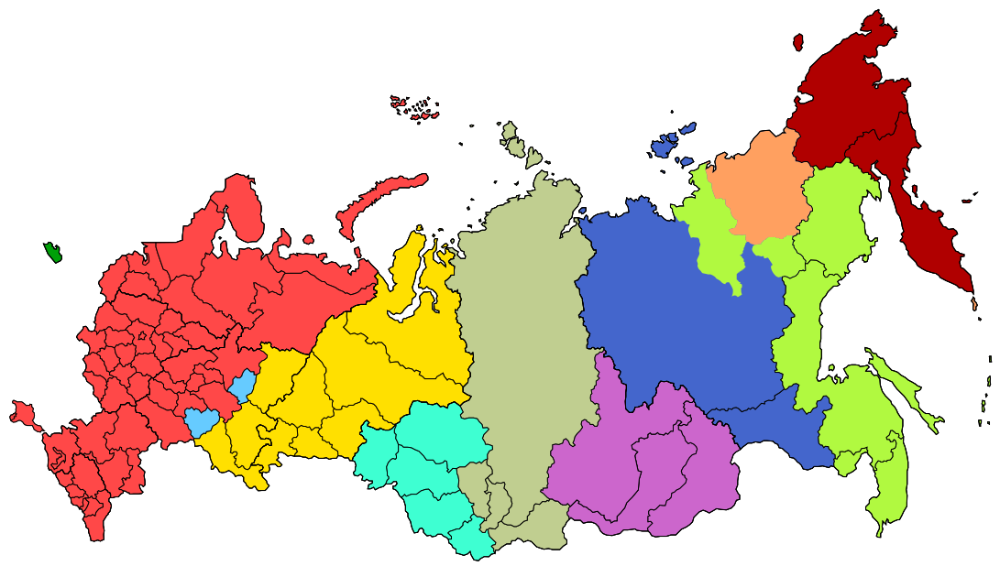

<span class="credit
">[Project Apollo Archive (Public Domain)](https://flic.kr/p/zA24mk)</span>



<span class="credit">[Day and Night world-map](http://www.timeanddate.com/worldclock/sunearth.html?day=10&month=11&year=2016&hour=19&min=30&sec=0&n=127&ntxt=Karlsruhe&earth=0)</span>


<span class="credit">Von TimeZonesBoy - Eigenes Werk, CC-BY-SA 4.0, https://commons.wikimedia.org/w/index.php?curid=42165217</span>

Note: Offsets are written with + or - depending whether they are right or left of the 0.


> A timezone is that part of the earthsurface that by governmental definition has the same
date and time

Note: Most timezones are now offset from UTC by full hours, though there are exceptions like nepal (4.25) or venezuela (-4.5)


## Excursion Time Coordinates


### GMT

* Noon depends on sun.<!-- .element: class="fragment" -->
* Offset of up to 16 minutes due differences in the earths rotation<!-- .element: class="fragment" -->

Note: Offset egalises itself throughout the year.


### UT/TAI

* Depends on atomic clocks.<!-- .element: class="fragment" -->
* Started 1955<!-- .element: class="fragment" -->
* Independent from solar orbit<!-- .element: class="fragment" -->
* Offset of 36 seconds as of 30th of June 2015 against UTC<!-- .element: class="fragment" -->

Note: Temps atomic international


### UTC

* Based on TAI<!-- .element: class="fragment" -->
* Started in 1961<!-- .element: class="fragment" -->
* adds leap seconds every now and then<!-- .element: class="fragment" -->
* offset between UTC and GMT max. 0.9 seconds<!-- .element: class="fragment" -->

Note: Started to become base of Timezone offsets from 1972


## Caveat

* Timezone - Sum of geographical region that shares the same coordinated time.
* Zonetime - The timeoffset against UTC (or GMT) of a geographical region

Note: Timezone-Name != Timezone Abbreviation

## To make it more complex


## Timezones change


<span class="credit">By Map_of_Russia_-_Time_Zones_(September_2011).svg: Lokal Profilderivative work: TZ master (talk) - Map_of_Russia_-_Time_Zones_(September_2011).svg, CC BY-SA 2.5, https://commons.wikimedia.org/w/index.php?curid=16761048</span>

<span class="credit">By PlatonPskov, CC BY-SA 2.5, https://commons.wikimedia.org/w/index.php?curid=33798576</span>

Note: Crimean anexion in 2014, During WW2 in Germany, Political reasons (Venezuela 2014, turkey, Tonga,Cyprus)


100 Years of<!-- .element: class="fragment" -->
## Summertime
## Daylight Savings Time<!-- .element: class="fragment" -->

Note: To save energie as because the human activity-cycle is offset to the daylight cycle
Summertime was "invented". Offsets the time 1 hour plus against default time-coordinate.
In germany in 1947 there was even 2 summertimes. Start of summertime is coordinated
but not the same in europe and america... 30 April 1916 Deutsches Reich


```php
new DateTimeZone('Europe/Berlin')->getTransitions();
/*
[21] => Array (
        [ts] => -717631200
        [time] => 1947-04-06T02:00:00+0000
        [offset] => 7200
        [isdst] => 1
        [abbr] => CEST
    )
[22] => Array (
        [ts] => -714610800
        [time] => 1947-05-11T01:00:00+0000
        [offset] => 10800
        [isdst] => 1
        [abbr] => CEMT
    )
[23] => Array (
        [ts] => -710380800
        [time] => 1947-06-29T00:00:00+0000
        [offset] => 7200
        [isdst] => 1
        [abbr] => CEST
    )
[24] => Array (
        [ts] => -701910000
        [time] => 1947-10-05T01:00:00+0000
        [offset] => 3600
        [isdst] =>
        [abbr] => CET
    )

*/
```


## Daylight Savings Time

* is not simply one hour offset
* starts at different times throughout the world
* is at different seasons on the hemispheres
* Be prepared for days with 23 or 25 hours!


##Summary

* Timezones are political definitions<!-- .element: class="fragment" -->
* Timezones change<!-- .element: class="fragment" -->
* Timezones cover a stripe from northpole to southpole<!-- .element: class="fragment" -->
* Zonetimes are defined by the offset from UTC<!-- .element: class="fragment" -->
* Summertime may add one hour (or more) to the Zonetime<!-- .element: class="fragment" -->
* Summertime does not change the timezone but the zonetime<!-- .element: class="fragment" -->


# &lt;/basics><?php