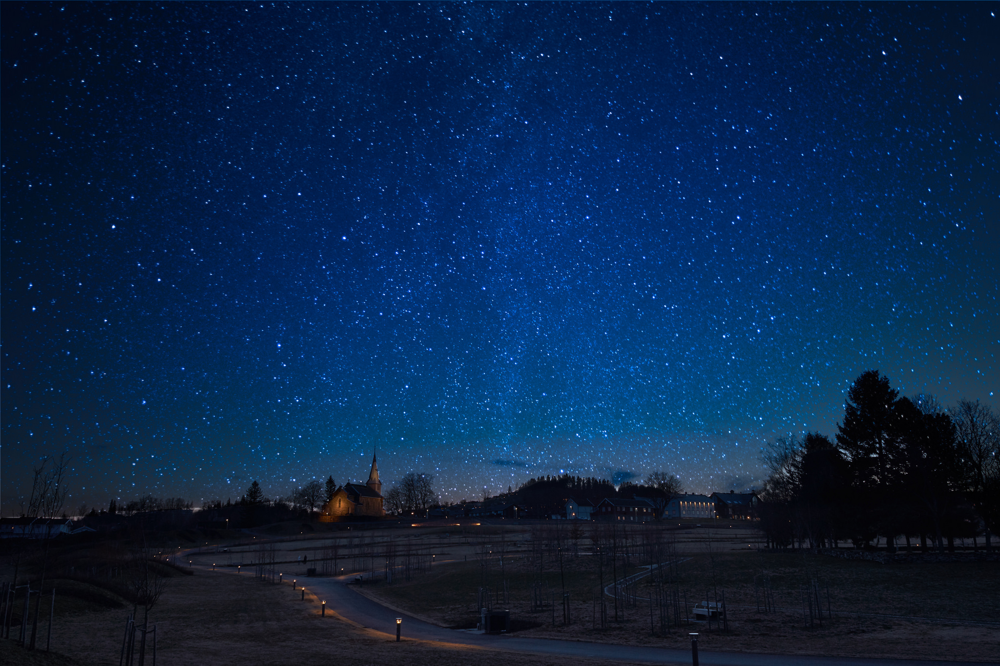
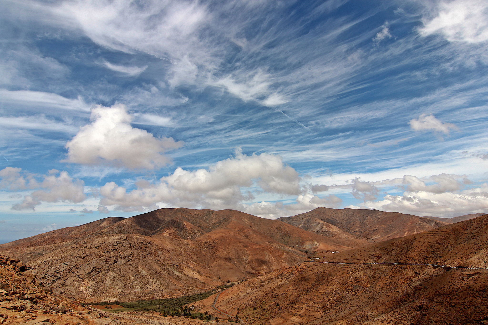
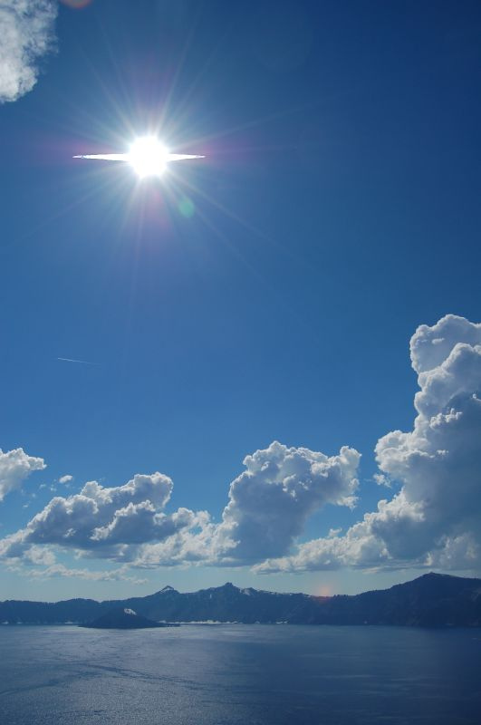
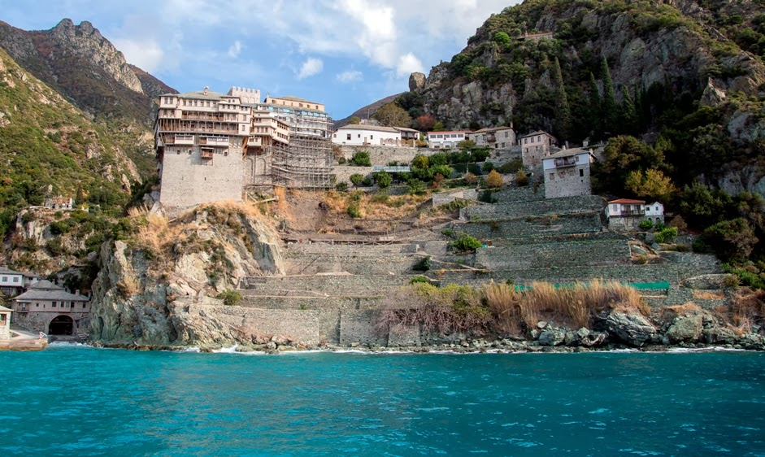

## Time

Note: In the beginning there was night and day

© Jonas Grimsgaard | https://flic.kr/p/rjnXKF | CC BY-NC-ND 2.0

© dicau58 | https://flic.kr/p/f65fbT | CC BY-SA 2.0

Note: And everything was great. Still until about 200 years ago that was only
slightly changed. There were morning, noon, evening and night.

@ Kevin Lau | https://flic.kr/p/u5pfZ | CC BY-NC-ND 2.0

Note: And all timing was related to the sun. "Break of dawn", "sunset", even "noon".
Days started the moment the sun wasn't visible anymore. That's still the case f.e. on Mount Athos or Jews

© someone10x | https://flic.kr/p/iLMLJo | CC BY 2.0

Note: Interesting as days start at different times between different monasteries
only some kilometers apart. No one noticed those differences. Traveling took longer
than the timedifference and so no one noticed. And it didn't matter what time it was.
