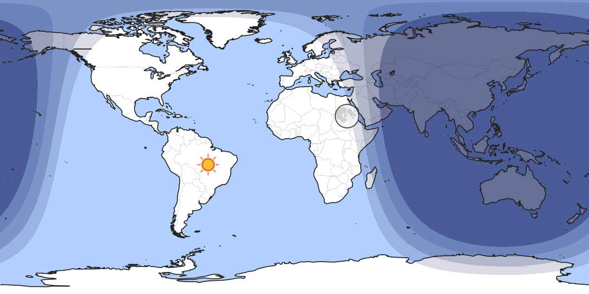
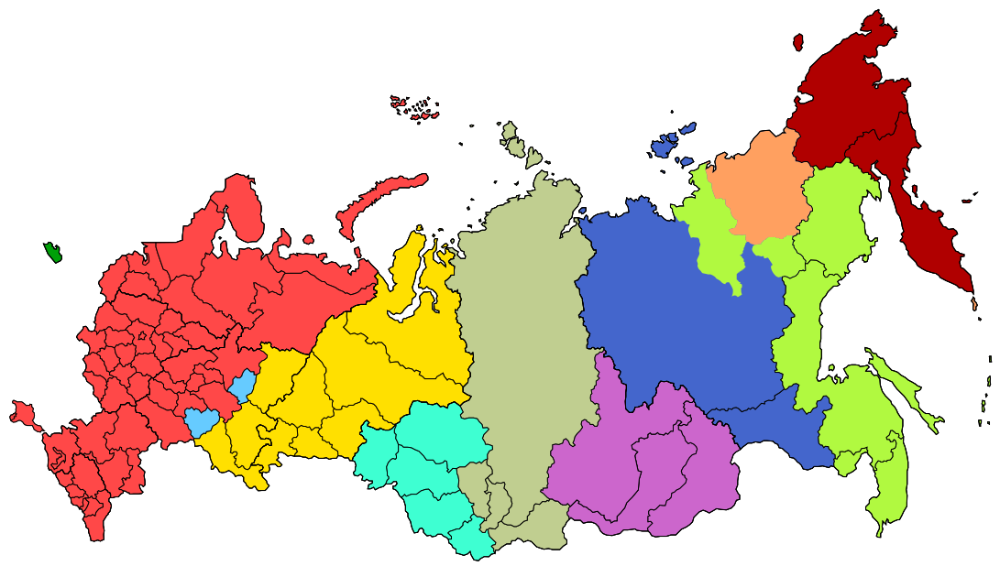

<span class="credit
">[Project Apollo Archive (Public Domain)](https://flic.kr/p/zA24mk)</span>



<span class="credit">[Day and Night world-map](https://www.timeanddate.com/worldclock/sunearth.html?day=2&month=12&year=2018&hour=12&min=00&sec=0&n=%3A&ntxt=Novi+Sad&earth=0)</span>


<span class="credit">[Von TimeZonesBoy - Eigenes Werk, CC-BY-SA 4.0](https://commons.wikimedia.org/w/index.php?curid=42165217)</span>

Note: Offsets are written with + or - depending whether they are right or left of the 0.


> A timezone is that part of the earthsurface that **by governmental definition** has the same
date and time

Note: Most timezones are now offset from UTC by full hours, though there are exceptions like nepal (5:45) or venezuela (-4:30)


## Caveat

* <!-- .element: class="fragment" --> Timezone - geographical region that shares the same coordinated time
* <!-- .element: class="fragment" --> Timezone-ID - identifier for the geographical region
* <!-- .element: class="fragment" --> Timezone-Abbreviation - sum of geographical region that shares the same coordinated time
* <!-- .element: class="fragment" --> Zonetime - The timeoffset against UTC (or GMT) of a geographical region

Note: Timezone-Name != Timezone Abbreviation


## To make it complex


## Timezones change


<span class="credit">[By Lokal Profil derivative work: TZ master (talk), CC BY-SA 2.5](https://commons.wikimedia.org/w/index.php?curid=16761048)</span>

<span class="credit">[By PlatonPskov, CC BY-SA 2.5](https://commons.wikimedia.org/w/index.php?curid=33798576)</span>

Note: Crimean anexion in 2014, During WW2 in Germany, Political reasons (Venezuela 2014, turkey, Tonga,Cyprus)


## To make it even more complex


102 Years of<!-- .element: class="fragment" -->
## Summertime
## Daylight Saving Time<!-- .element: class="fragment" -->

Note: To save energie as because the human activity-cycle is offset to the daylight cycle
Summertime was "invented". Offsets the time 1 hour plus against default time-coordinate.
In germany in 1947 there was even 2 summertimes. Start of summertime is coordinated
but not the same in europe and america... 30 April 1916 Deutsches Reich


```php
(new DateTimeZone('Europe/Belgrade'))->getTransitions();
/*
  [84] => Array
  (
      [ts] => 1553994000
      [time] => 2019-03-31T01:00:00+0000
      [offset] => 7200
      [isdst] => 1
      [abbr] => CEST
  )
  
  [121] => Array
  (
      [ts] => 2140045200
      [time] => 2037-10-25T01:00:00+0000
      [offset] => 3600
      [isdst] => 
      [abbr] => CET
  )
*/
```


## Daylight Saving Time

* is not simply one hour offset<!-- .element: class="fragment" -->
* starts at different times throughout the world<!-- .element: class="fragment" -->
* is at different seasons on the hemispheres<!-- .element: class="fragment" -->
* Be prepared for days with more or less than 24 hours<!-- .element: class="fragment" -->
* can occur more than once a year<!-- .element: class="fragment" -->


## Summary

* Timezones are political definitions<!-- .element: class="fragment" -->
* Timezones change<!-- .element: class="fragment" -->
* Timezones-Abbreviations cover a stripe from northpole to southpole<!-- .element: class="fragment" -->
* Zonetimes are defined by the offset from UTC<!-- .element: class="fragment" -->
* DST may add or remove time to or from the Zonetime<!-- .element: class="fragment" -->
* DST does not change the timezone but the zonetime and the timezone-abbreviation<!-- .element: class="fragment" -->


# &lt;/basics><?php
